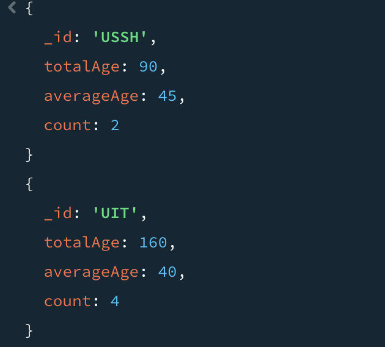

# LAB01: MongoDB – CRUD Operation

## Mục tiêu
- Thiết lập môi trường làm việc với cơ sở dữ liệu NoSQL trên MongoDB Atlas.
- Thành thạo thao tác CRUD (Create, Read, Update, Delete) và truy vấn/ thống kê cơ bản.

## Công cụ / Môi trường
- **MongoDB Atlas**: tạo và quản lý cluster cơ sở dữ liệu trên đám mây.
- **MongoDB Compass**: giao diện desktop để kết nối và quan sát dữ liệu.
- **mongosh (Mongo Shell)**: công cụ dòng lệnh (tích hợp trong Compass) để thực thi truy vấn.

##  Cách chạy 
1) **Cấu hình hệ thống**  
   Đăng ký MongoDB Atlas → tạo cluster miễn phí → nạp sample data → kết nối bằng MongoDB Compass.

2) **Mở trình điều khiển**  
   Khởi động `mongosh` trong Compass (hoặc Mongo Shell độc lập).

3) **Thực thi lệnh**  
   - Tạo database tên `MSSV-IE213` và collection `employees`.  
   - Thực hiện các lệnh: `insertMany`, `find`, `updateMany`, `deleteMany`, kèm các phép thống kê (tổng, trung bình) theo yêu cầu.

## Kết quả
Bài 1: 

Hình 1. Giao diện MongoDB Atlas cung cấp connection string để kết nối Cluster0 với MongoDB Compass.

Hình 2. Giao diện MongoDB Compass tạo kết nối mới bằng cách nhập connection string từ MongoDB Atlas.

Bài 2: 
2.1 Tạo cơ sở dữ liệu có tên MSSV-IE213 trên cluster của bạn (trong đó MSSV là mã số sinh
viên của bạn).

- Chuyển sang database 23521827-IE213
=> MongoDB chỉ thực sự tạo database khi  ghi dữ liệu vào.
2.2 Thêm các document sau đây vào collection có tên là employees trong db vừa được tạo ở trên:
{"id":1,"name":{"first":"John","last":"Doe"},"age":48}
{"id":2,"name":{"first":"Jane","last":"Doe"},"age":16}
{"id":3,"name":{"first":"Alice","last":"A"},"age":32}
{"id":4,"name":{"first":"Bob","last":"B"},"age":64}

	•	db.employees là collection employees
	•	insertMany() dùng để chèn nhiều document cùng lúc
Kết quả: 4 bản ghi thành công vào collection.
2.3 Hãy biến trường id trong các document trên trở thành duy nhất. Có nghĩa là không thể thêm một document mới với giá trị id đã tồn tại.

	•	{ id: 1 } nghĩa là index tăng dần trên field id
	•	{ unique: true } nghĩa là không cho phép trùng
Test: insert 1 document có id:1

=> Thông báo lỗi duplicate key error

2.4 Hãy viết lệnh để tìm document có firstname là John và lastname là Doe.
- dùng dot notination để truy cập field con

Kết quả: 

2.5 Hãy viết lệnh để tìm những người có tuổi trên 30 và dưới 60.
•	$gt:  lớn hơn
•	$lt:  nhỏ hơn

Kết quả:

2.6 Thêm các document sau đây vào collection:
{"id":5,"name":{"first":"Rooney", "middle":"K", "last":"A"},"age":30}
{"id":6,"name":{"first":"Ronaldo", "middle":"T", "last":"B"},"age":60}
Sau đó viết lệnh để tìm tất cả các document có middle name.
- Thêm document vào collection: 

Tìm tất cả document có middle name
•	$exists: true nghĩa là field đó có tồn tại trong document

Kết quả: 

2.7 Cho rằng là những document nào đang có middle name là không đúng, hãy xoá middle name ra khỏi các document đó
	•	updateMany() cập nhật nhiều document
	•	điều kiện lọc: document nào có name.middle
	•	$unset dùng để xóa field

Kết quả: 

Đã xóa middle name của document 5,6
Test lại:

=> Không còn document nào có middle name

2.8 Hãy thêm trường dữ liệu organization: "UIT" vào tất cả các document trong employees collection.

	•	{} nghĩa là chọn tất cả document
	•	$set thêm mới field nếu chưa có, hoặc cập nhật nếu đã có
Kết quả:  chạy lệnh find thấy document có organization: "UIT

2.9 Hãy điều chỉnh organization của nhân viên có id là 5 và 6 thành "USSH".

Kết quả:

2.10 Hãy viết lệnh để tính tổng tuổi và tuổi trung bình của nhân viên thuộc 2 organization là UIT và USSH.

Giải thích các bước:
Bước 1: $match: lọc ra nhân viên thuộc UIT , USSH
Bước 2: $group: nhóm theo organization
Rồi tính:
	•	totalAge: tổng tuổi
	•	averageAge: tuổi trung bình
	•	count: số lượng nhân viên
Kết quả:

Check 
- USSH:

Tổng tuổi: 90, Trung bình: 45;
- UIT

Tổng tuổi: 160, Trung bình: 40;
