# LAB01: MongoDB – CRUD Operation

## Mục tiêu
- Thiết lập môi trường làm việc với MongoDB Atlas + Compass + mongosh.
- Thực hành CRUD và các truy vấn/ thống kê cơ bản trên collection `employees`.

## Công cụ / Môi trường
- **MongoDB Atlas**: tạo & quản lý cluster DB trên đám mây.
- **MongoDB Compass**: giao diện desktop để kết nối và quan sát dữ liệu.
- **mongosh (Mongo Shell)**: dòng lệnh (tích hợp trong Compass) để thực thi truy vấn.

## Thiết lập nhanh
1. Tạo cluster miễn phí trên MongoDB Atlas, nạp `sample data`.
2. Cài MongoDB Compass, lấy connection string từ Atlas và kết nối.
3. Mở `mongosh` trong Compass (hoặc Mongo Shell độc lập).

## Bài 1: Kết nối Atlas ↔ Compass
- Lấy connection string từ Atlas, dán vào Compass để tạo kết nối.  
    
  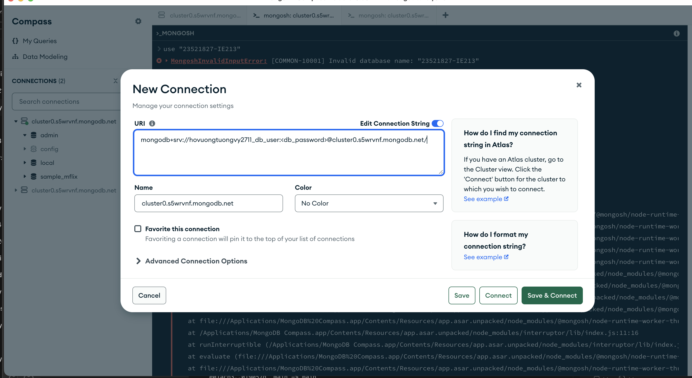

## Bài 2: CRUD trên collection `employees`
> Database tên `MSSV-IE213`; ví dụ dùng MSSV `23521827`.

- **2.1 Tạo database & collection**  
  ```js
  use MSSV-IE213
  db.createCollection("employees")
  ```  
  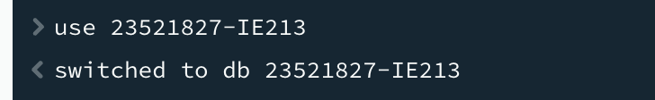

- **2.2 Thêm 4 document đầu tiên**  
  ```js
  db.employees.insertMany([
    { id: 1, name: { first: "John", last: "Doe" }, age: 48 },
    { id: 2, name: { first: "Jane", last: "Doe" }, age: 16 },
    { id: 3, name: { first: "Alice", last: "A" },  age: 32 },
    { id: 4, name: { first: "Bob",   last: "B" },  age: 64 }
  ])
  ```
  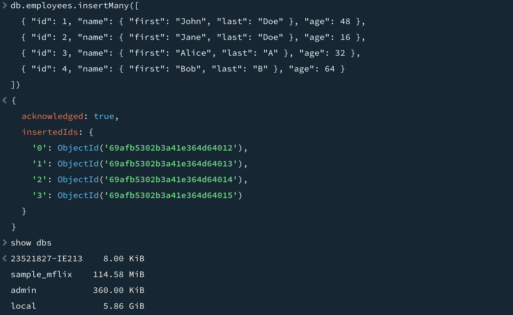

- **2.3 Tạo unique index cho `id`**  
  ```js
  db.employees.createIndex({ id: 1 }, { unique: true })
  ```  
    
  Thử chèn trùng sẽ lỗi: 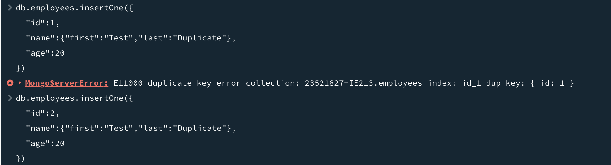

- **2.4 Tìm John Doe**  
  ```js
  db.employees.find({ "name.first": "John", "name.last": "Doe" })
  ```  
  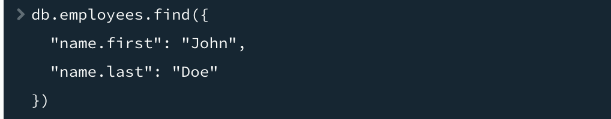  
  Kết quả: 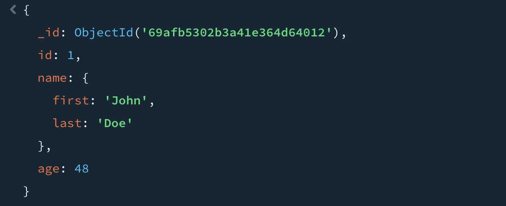

- **2.5 Tìm tuổi 30–60**  
  ```js
  db.employees.find({ age: { $gt: 30, $lt: 60 } })
  ```  
    
  Kết quả: 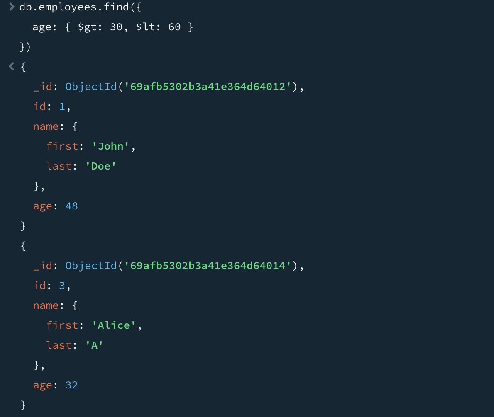

- **2.6 Thêm nhân viên có middle name & lọc**  
  ```js
  db.employees.insertMany([
    { id: 5, name: { first: "Rooney",  middle: "K", last: "A" }, age: 30 },
    { id: 6, name: { first: "Ronaldo", middle: "T", last: "B" }, age: 60 }
  ])
  db.employees.find({ "name.middle": { $exists: true } })
  ```  
  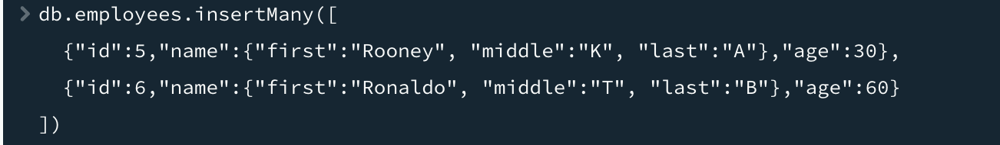  
    
  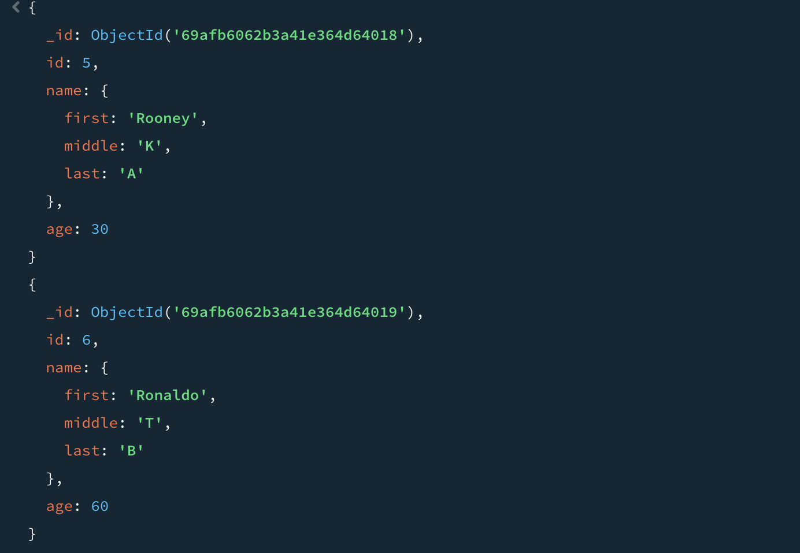

- **2.7 Xóa middle name cho tất cả**  
  ```js
  db.employees.updateMany(
    { "name.middle": { $exists: true } },
    { $unset: { "name.middle": "" } }
  )
  ```  
  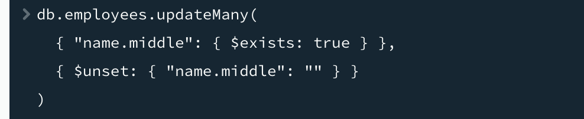  
  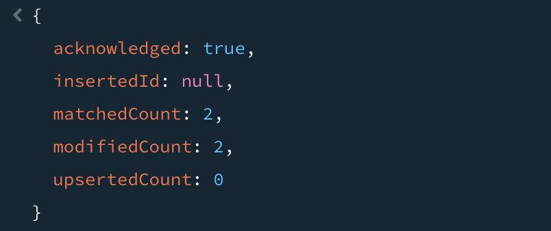  
  Kiểm tra lại: 

- **2.8 Thêm field `organization: "UIT"` cho toàn bộ**  
  ```js
  db.employees.updateMany({}, { $set: { organization: "UIT" } })
  ```  
  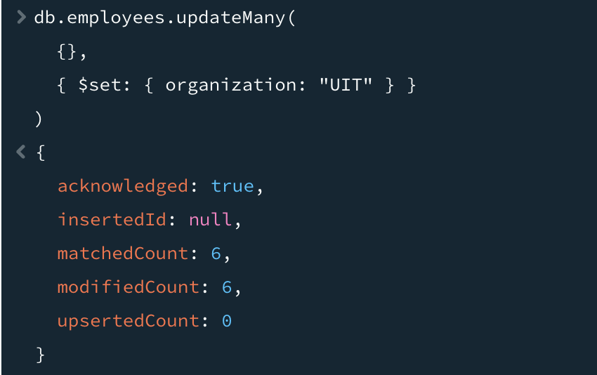  
  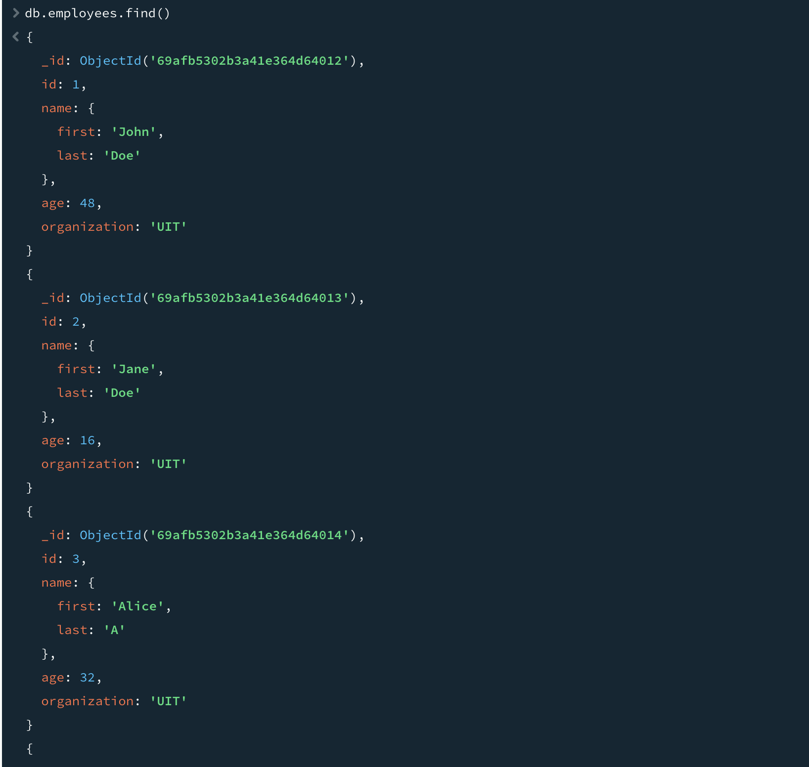

- **2.9 Đổi organization nhân viên id 5 & 6 thành "USSH"**  
  ```js
  db.employees.updateMany(
    { id: { $in: [5, 6] } },
    { $set: { organization: "USSH" } }
  )
  ```  
  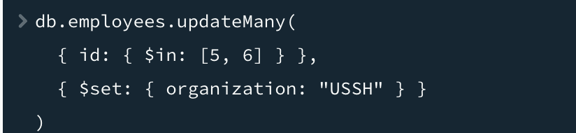  
  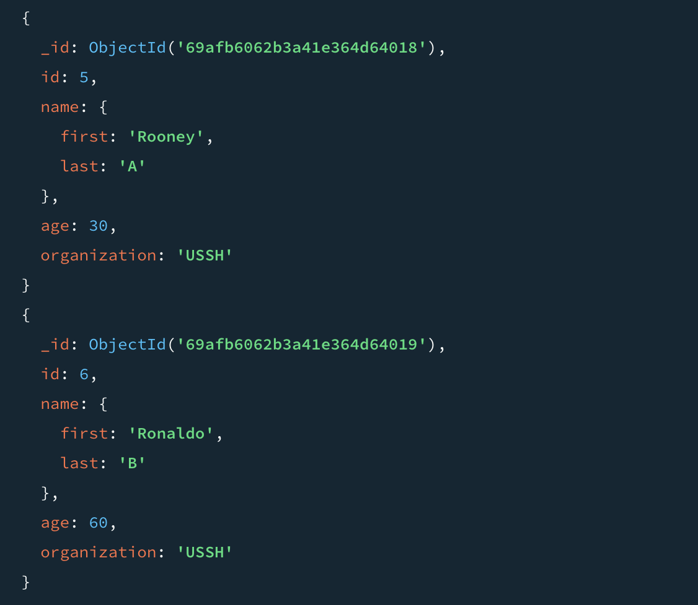

- **2.10 Tính tổng tuổi & tuổi trung bình theo organization**  
  ```js
  db.employees.aggregate([
    { $match: { organization: { $in: ["UIT", "USSH"] } } },
    {
      $group: {
        _id: "$organization",
        totalAge: { $sum: "$age" },
        averageAge: { $avg: "$age" },
        count: { $sum: 1 }
      }
    }
  ])
  ```  
  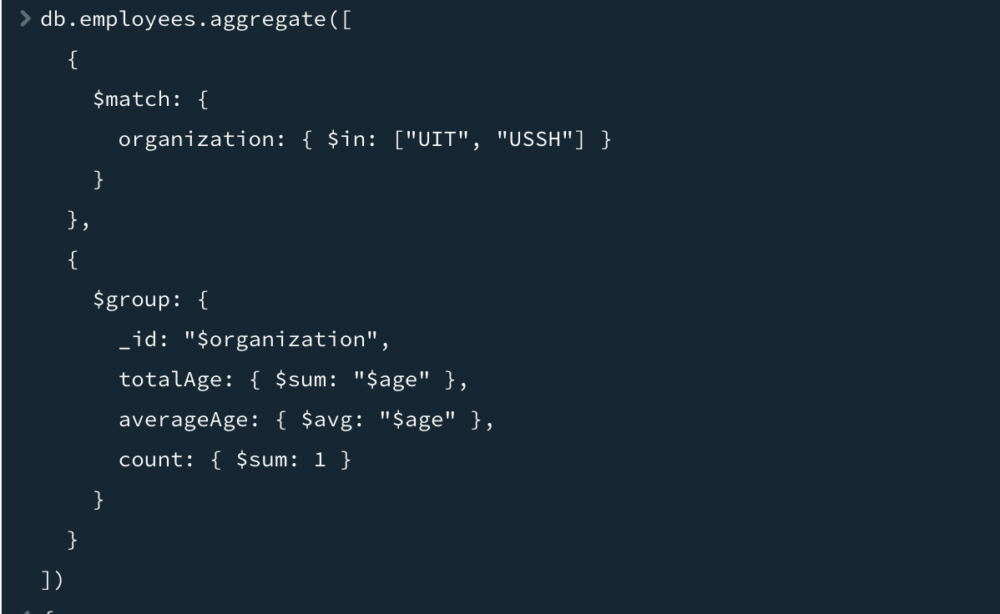  
  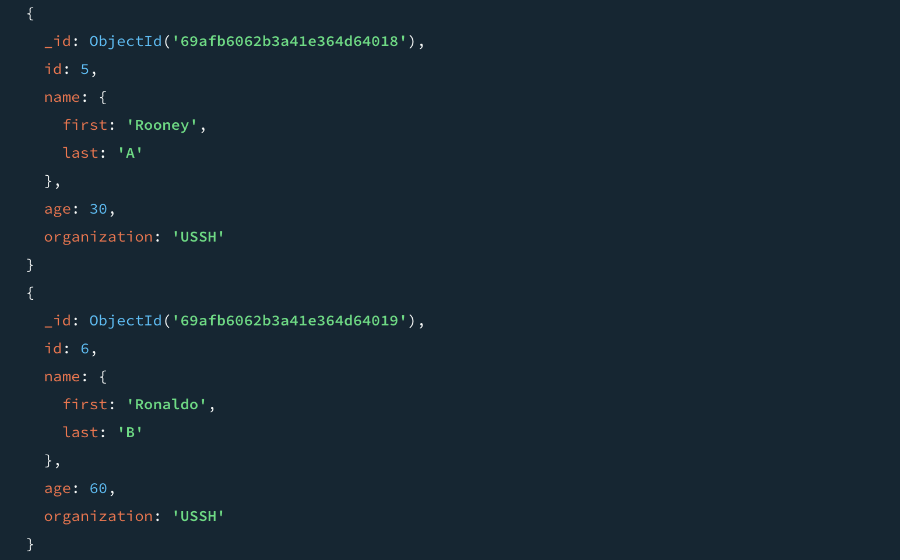  
  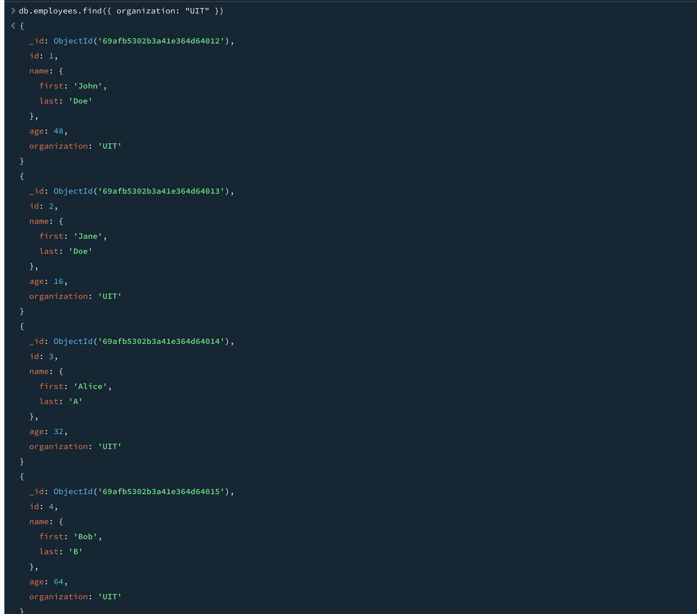

