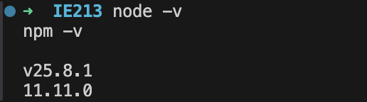
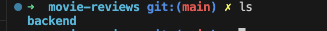
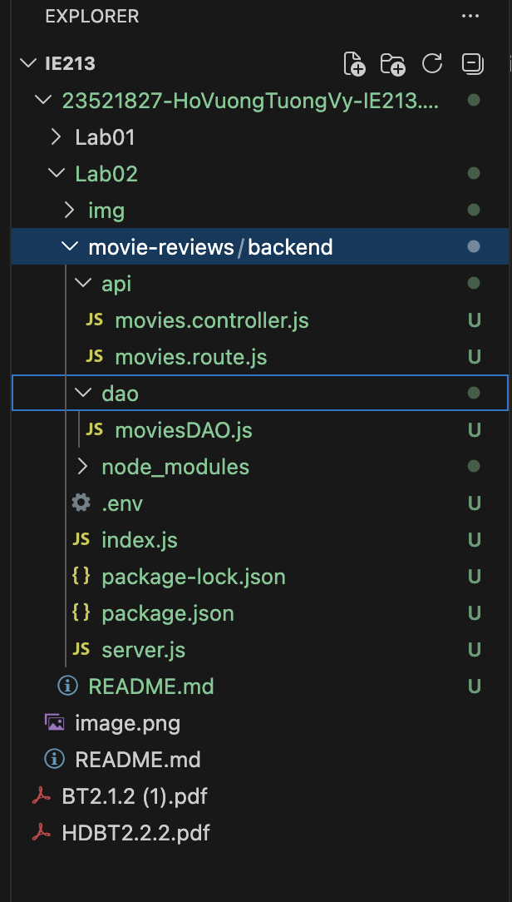
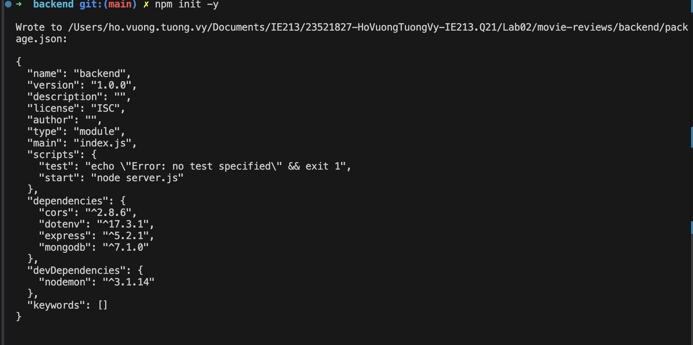
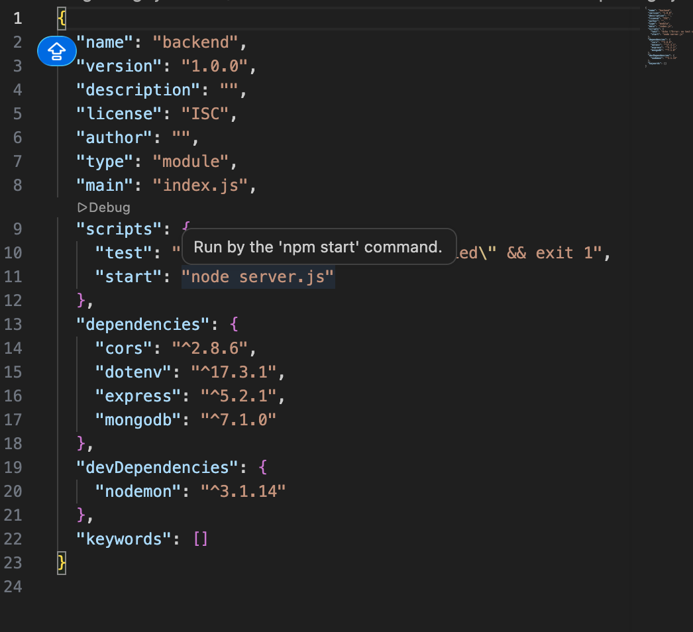
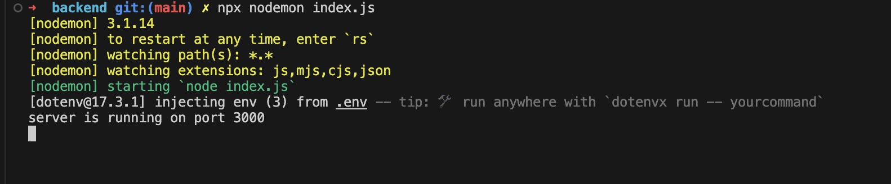
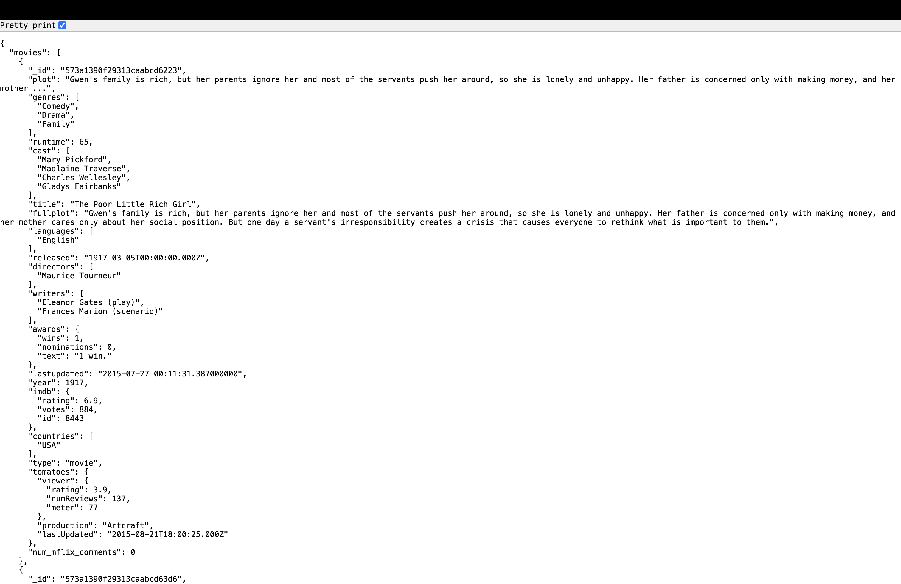
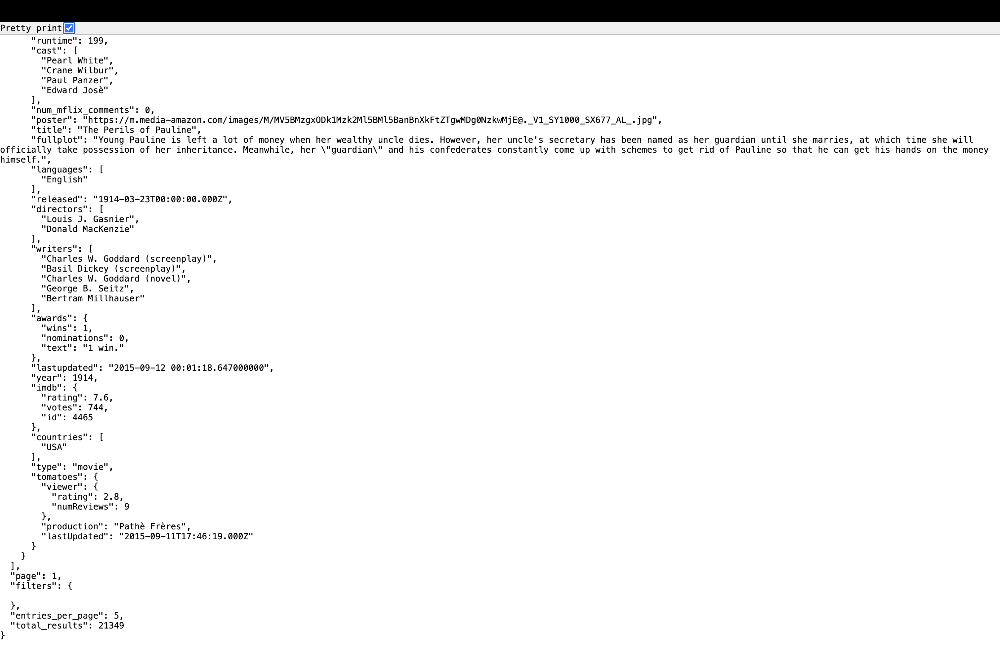
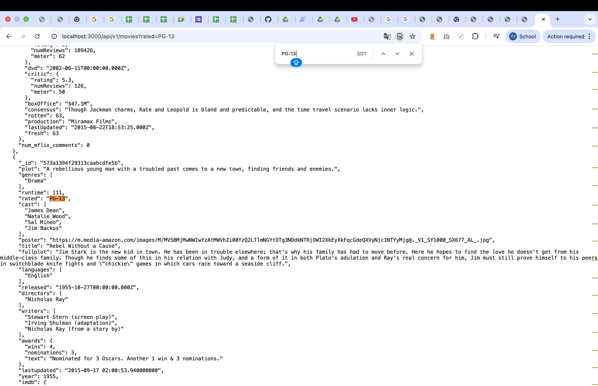
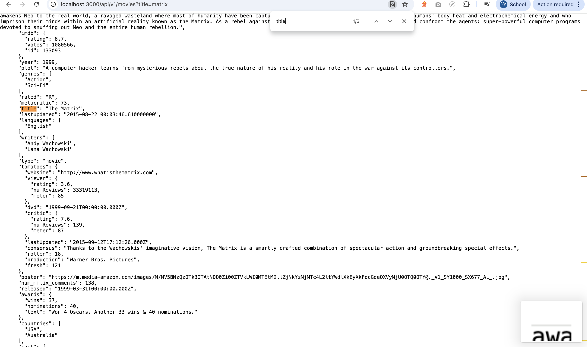

# Lab02 - Thiết lập Backend với NodeJS/ExpressJS

## 1. Thông tin sinh viên

| Họ tên | MSSV | Lớp |
| :-- | :-- | :-- |
| **Hồ Vương Tường Vy** | **23521827** | **IE213.Q21** |

## 2. Thông tin môn học

- Môn học: **IE213.Q21 - Kỹ thuật phát triển hệ thống web**

## 3. Nội dung bài thực hành

Lab02 tập trung vào việc thiết lập backend cơ bản cho ứng dụng Movie Reviews bằng **NodeJS**, **ExpressJS** và **MongoDB Atlas**. Ứng dụng được tổ chức theo mô hình:

- `route`: nhận request từ client
- `controller`: xử lý trung gian và gom dữ liệu trả về
- `dao`: truy xuất dữ liệu từ MongoDB

Backend hỗ trợ:

- lấy danh sách phim
- phân trang dữ liệu
- lọc theo `rated`
- tìm phim theo `title`

## 4. Cấu trúc thư mục chính

```text
Lab02/
├── README.md
└── movie-reviews/
    └── backend/
        ├── api/
        │   ├── movies.controller.js
        │   └── movies.route.js
        ├── dao/
        │   └── moviesDAO.js
        ├── .env
        ├── index.js
        ├── package.json
        └── server.js
```

## 5. Cách chạy chương trình

### 5.1 Di chuyển vào thư mục backend

```bash
cd Lab02/movie-reviews/backend
```

### 5.2 Cài đặt dependency

```bash
npm install
```

### 5.3 Cấu hình biến môi trường

Tạo file `.env` trong thư mục `backend` với nội dung:

```env
MOVIEREVIEWS_DB_URI=<mongodb-atlas-uri>
MOVIEREVIEWS_NS=sample_mflix
PORT=3000
```

### 5.4 Chạy server

Chạy trực tiếp:

```bash
node index.js
```

Hoặc chạy bằng nodemon:

```bash
npx nodemon index.js
```

### 5.5 Kiểm tra trên trình duyệt hoặc Postman

- `http://localhost:3000/api/v1/movies`
- `http://localhost:3000/api/v1/movies?page=1&moviesPerPage=5`
- `http://localhost:3000/api/v1/movies?rated=PG`
- `http://localhost:3000/api/v1/movies?title=matrix`

## 6. Chi tiết thực hiện

## Bài 1: Thiết lập môi trường

### 1.1 Cài đặt NodeJS

Thực hiện:

- Tải và cài đặt NodeJS từ `nodejs.org`
- Kiểm tra phiên bản bằng lệnh:

```bash
node -v
npm -v
```

Kết quả:

- Máy đã cài đặt thành công NodeJS và npm



### 1.2 Cài đặt công cụ soạn thảo mã nguồn

Thực hiện:

- Sử dụng Visual Studio Code để tạo và chỉnh sửa mã nguồn

Kết quả:

- Có thể mở thư mục lab và thao tác trực tiếp trên source code backend

Ảnh minh họa:



### 1.3 Khởi tạo cây thư mục dự án

Thực hiện:

- Tạo cấu trúc thư mục `movie-reviews/backend`
- Tổ chức các thư mục `api`, `dao` và các file chính của server

Kết quả:

- Hoàn thành cấu trúc thư mục ban đầu cho ứng dụng backend

Ảnh minh họa:


### 1.4 Khởi tạo dự án với npm

Thực hiện:

```bash
npm init -y
```

Kết quả:

- Tạo file `package.json` cho project backend

Ảnh minh họa:


### 1.5 Cài đặt các thư viện cần thiết

Thực hiện:

```bash
npm install mongodb express cors dotenv
```

Kết quả:

- Các thư viện cần thiết cho backend được thêm vào `dependencies`

Ảnh minh họa:



### 1.6 Cài đặt nodemon

Thực hiện:

```bash
npm install --save-dev nodemon
```

Kết quả:

- Có thể dùng `npx nodemon index.js` để tự động khởi động lại server khi thay đổi mã nguồn

Ảnh minh họa:


## Bài 2: Xây dựng backend cho Movie Reviews

### 2.1 Tạo file `server.js`

Thực hiện:

- Import `express`, `cors` và router movies
- Khởi tạo ứng dụng Express
- Cấu hình middleware `cors()` và `express.json()`
- Định tuyến `/api/v1/movies`
- Xử lý các route không tồn tại bằng phản hồi `404`

Mã chính:

```javascript
import express from "express";
import cors from "cors";
import movies from "./api/movies.route.js";

const app = express();

app.use(cors());
app.use(express.json());
app.use("/api/v1/movies", movies);

app.use((req, res) => {
  res.status(404).json({ error: "not found" });
});

export default app;
```

Kết quả:

- Web server được khởi tạo thành công và có route cơ bản cho API movies

### 2.2 Tạo file `.env`

Thực hiện:

- Tạo file `.env` trong thư mục `backend`
- Khai báo URI kết nối MongoDB Atlas, namespace database và cổng chạy server

Mẫu cấu hình:

```env
MOVIEREVIEWS_DB_URI=<mongodb-atlas-uri>
MOVIEREVIEWS_NS=sample_mflix
PORT=3000
```

Kết quả:

- Thông tin cấu hình được tách ra khỏi source code


### 2.3 Tạo file `index.js`

Thực hiện:

- Import `app`, `mongodb`, `dotenv` và `MoviesDAO`
- Tạo `async function main()`
- Dùng `dotenv.config()` để nạp biến môi trường
- Tạo `MongoClient`
- Kết nối đến MongoDB bằng `await client.connect()`
- Gọi `await MoviesDAO.injectDB(client)` trước khi chạy server

Mã chính:

```javascript
async function main() {
  dotenv.config();

  const client = new mongodb.MongoClient(process.env.MOVIEREVIEWS_DB_URI);
  const port = process.env.PORT || 3000;

  try {
    await client.connect();
    await MoviesDAO.injectDB(client);
    app.listen(port, () => {
      console.log(`server is running on port ${port}`);
    });
  } catch (err) {
    console.error(err);
    process.exit(1);
  }
}

main().catch(console.error);
```

Kết quả:
- Server chỉ được khởi chạy sau khi kết nối cơ sở dữ liệu thành công

### 2.4 Tạo file `api/movies.route.js`

Thực hiện:

- Tạo router bằng `express.Router()`
- Định tuyến `GET /` đến hàm `MoviesController.apiGetMovies`

Mã chính:

```javascript
router.route("/").get(MoviesController.apiGetMovies);
```

Kết quả:

- Endpoint `GET /api/v1/movies` được nối với controller xử lý dữ liệu


### 2.5 Tạo file `dao/moviesDAO.js`

Thực hiện:

- Tạo class `MoviesDAO`
- Viết hàm `injectDB(conn)` để lấy collection `movies`
- Viết hàm `getMovies({ filters, page, moviesPerPage })`
- Hỗ trợ:
  - phân trang bằng `limit()` và `skip()`
  - lọc theo `rated`
  - tìm theo `title`

Mã chính:

```javascript
static async getMovies({
  filters = null,
  page = 0,
  moviesPerPage = 20,
} = {}) {
  let query;

  if (filters) {
    if ("title" in filters) {
      query = { title: { $regex: filters.title, $options: "i" } };
    } else if ("rated" in filters) {
      query = { rated: { $eq: filters.rated } };
    }
  }

  const cursor = await movies
    .find(query)
    .limit(moviesPerPage)
    .skip(moviesPerPage * page);
}
```

Kết quả:

- Tầng DAO truy xuất dữ liệu từ MongoDB và hỗ trợ lọc, tìm kiếm, phân trang


### 2.6 Tạo file `api/movies.controller.js`

Thực hiện:

- Tạo class `MoviesController`
- Viết hàm `apiGetMovies(req, res, next)`
- Đọc các query parameter:
  - `page`
  - `moviesPerPage`
  - `rated`
  - `title`
- Gọi `MoviesDAO.getMovies(...)`
- Trả kết quả JSON về cho client

Kết quả:

- Controller đóng vai trò trung gian giữa route và DAO


### 2.7 Kiểm tra endpoint

Thực hiện:

- Chạy backend
- Mở trình duyệt hoặc Postman để gọi các API sau:

```text
http://localhost:3000/api/v1/movies
http://localhost:3000/api/v1/movies?page=1&moviesPerPage=5
http://localhost:3000/api/v1/movies?rated=PG-13
http://localhost:3000/api/v1/movies?title=matrix
```

Kết quả:
- API trả về dữ liệu phim ở dạng JSON
- Hỗ trợ phân trang
- Hỗ trợ lọc theo `rated`
- Hỗ trợ tìm kiếm theo `title`

Ảnh minh họa
http://localhost:3000/api/v1/movies

http://localhost:3000/api/v1/movies?page=1&moviesPerPage=5

http://localhost:3000/api/v1/movies?rated=PG-13


## 7. Kết luận

Qua Lab02, em đã thiết lập được backend cơ bản bằng NodeJS/ExpressJS, kết nối MongoDB Atlas và tổ chức mã nguồn theo mô hình route/controller/dao. Ứng dụng có thể truy vấn danh sách phim, phân trang dữ liệu và hỗ trợ một số điều kiện lọc cơ bản phục vụ cho các bài thực hành tiếp theo.
