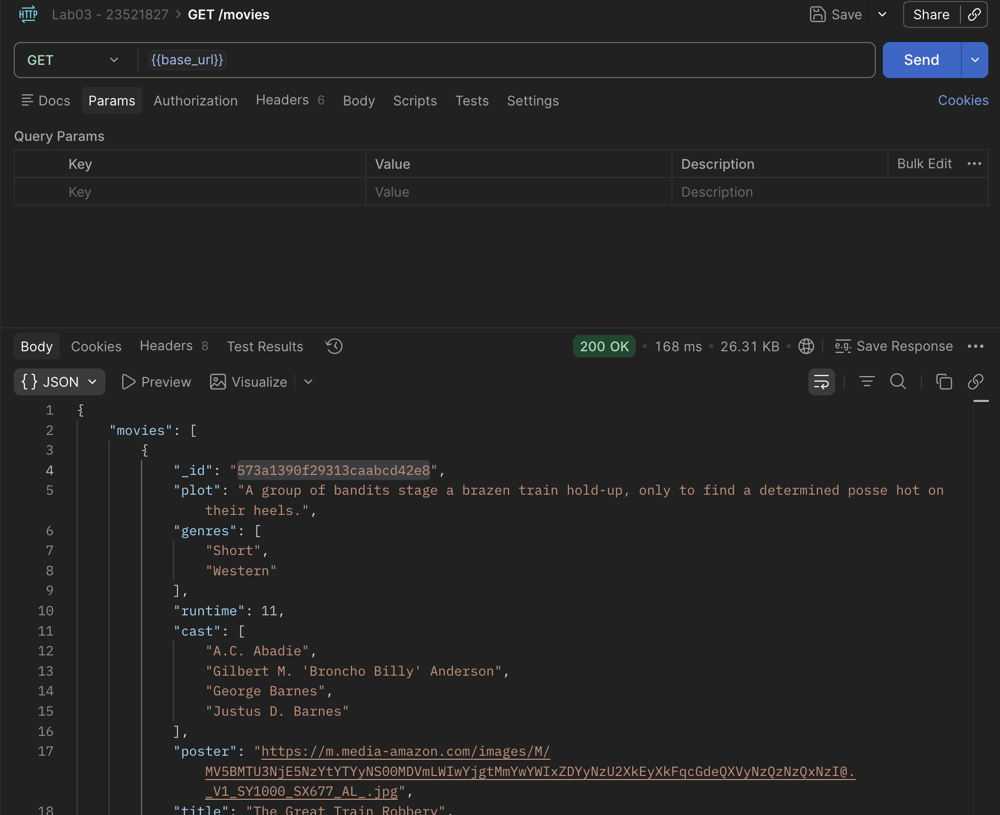
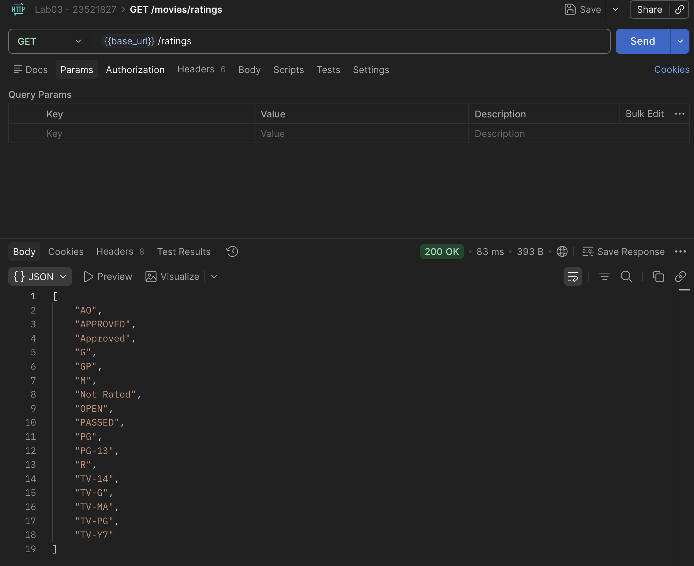
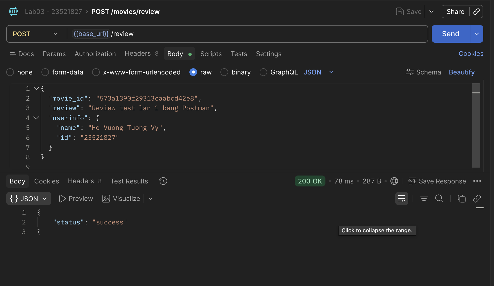
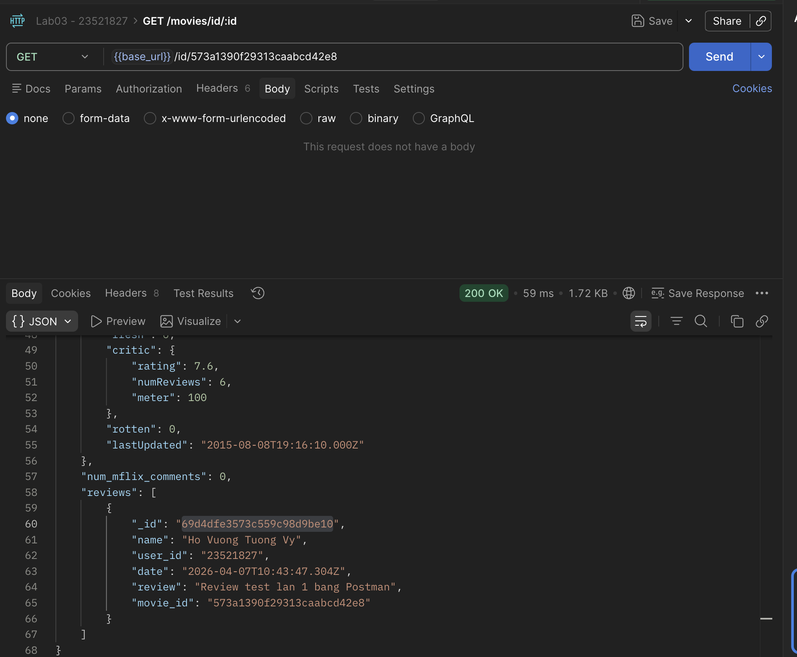
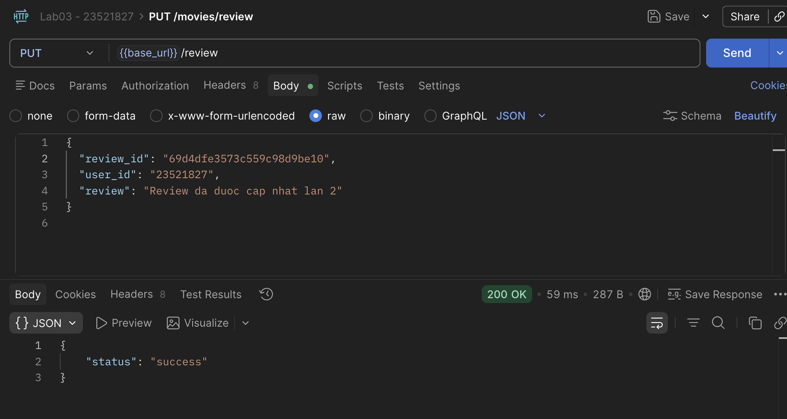
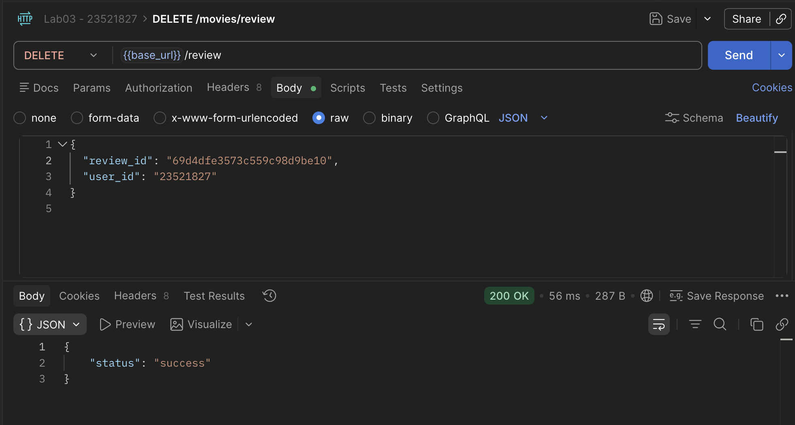

# Lab03 - Hoàn thiện Back-end cho ứng dụng Movie Reviews

## 1. Thông tin sinh viên

| Họ tên | MSSV | Lớp |
| :-- | :-- | :-- |
| **Hồ Vương Tường Vy** | **23521827** | **IE213.Q21** |

## 2. Thông tin môn học

- Môn học: **IE213.Q21 - Kỹ thuật phát triển hệ thống web**

## 3. Nội dung bài thực hành

Lab03 tập trung vào việc hoàn thiện back-end cho ứng dụng Movie Reviews dựa trên nền tảng của Lab02.

Nội dung chính:

- mở rộng định tuyến cho review (`POST/PUT/DELETE`)
- xây dựng `ReviewsController` để xử lý request review
- xây dựng `ReviewsDAO` để thao tác dữ liệu review trên MongoDB
- bổ sung API lấy chi tiết phim theo `id` kèm danh sách review
- bổ sung API lấy danh sách `rated` (ratings) từ collection movies

Các thành phần chính vẫn theo mô hình:

- `route`: nhận và định tuyến request
- `controller`: xử lý request/response
- `dao`: truy cập dữ liệu MongoDB

## 4. Cấu trúc thư mục chính

```text
Lab03/
├── BTTH3.pdf
├── README.md
├── img/
│   ├── postman_01_get_movies.png
│   ├── postman_02_get_ratings.png
│   ├── postman_03_post_review.png
│   ├── postman_04_get_movie_by_id.png
│   ├── postman_05_put_review.png
│   └── postman_06_delete_review.png
└── movie-reviews/
    └── backend/
        ├── api/
        │   ├── movies.controller.js
        │   ├── movies.route.js
        │   └── reviews.controller.js
        ├── dao/
        │   ├── moviesDAO.js
        │   └── reviewsDAO.js
        ├── .env
        ├── .gitignore
        ├── index.js
        ├── package.json
        └── server.js
```

## 5. Cách chạy chương trình

### 5.1 Di chuyển vào thư mục backend

```bash
cd Lab03/movie-reviews/backend
```

### 5.2 Cài đặt dependency

```bash
npm install
```

### 5.3 Cấu hình biến môi trường

Tạo file `.env` trong thư mục `backend`:

```env
PORT=3000
MOVIEREVIEWS_DB_URI=<mongodb-atlas-uri>
MOVIEREVIEWS_NS=sample_mflix
```

### 5.4 Chạy server

```bash
npm start
```

Hoặc:

```bash
npx nodemon index.js
```

### 5.5 Kiểm tra API nhanh

- `GET http://localhost:3000/api/v1/movies`
- `GET http://localhost:3000/api/v1/movies/ratings`
- `GET http://localhost:3000/api/v1/movies/id/<movie_id>`
- `POST http://localhost:3000/api/v1/movies/review`
- `PUT http://localhost:3000/api/v1/movies/review`
- `DELETE http://localhost:3000/api/v1/movies/review`

## 6. Chi tiết thực hiện

## Bài 1: Thiết lập định tuyến cho review

### 1.1 Cập nhật `movies.route.js`

Thực hiện:

- thêm route `GET /id/:id` cho chi tiết phim
- thêm route `GET /ratings` cho danh sách rating
- thêm route `POST/PUT/DELETE /review` cho thao tác review

Mã chính:

```javascript
import express from "express";
import MoviesController from "./movies.controller.js";
import ReviewsController from "./reviews.controller.js";

const router = express.Router();

router.route("/").get(MoviesController.apiGetMovies);
router.route("/id/:id").get(MoviesController.apiGetMovieById);
router.route("/ratings").get(MoviesController.apiGetRatings);

router
  .route("/review")
  .post(ReviewsController.apiPostReview)
  .put(ReviewsController.apiUpdateReview)
  .delete(ReviewsController.apiDeleteReview);

export default router;
```

Kết quả:

- định tuyến đã hỗ trợ đầy đủ API theo yêu cầu BTTH3


## Bài 2: Thiết lập Controller cho review

### 2.1 Tạo file `reviews.controller.js`

Thực hiện:

- tạo class `ReviewsController`
- thêm phương thức `apiPostReview()`
- thêm phương thức `apiUpdateReview()`
- thêm phương thức `apiDeleteReview()`

Mã chính:

```javascript
import ReviewsDAO from "../dao/reviewsDAO.js";

export default class ReviewsController {
  static async apiPostReview(req, res, next) {
    try {
      const movieId = req.body.movie_id;
      const review = req.body.review;
      const userInfo = req.body.userinfo;
      const date = new Date();

      const reviewResponse = await ReviewsDAO.addReview(
        movieId,
        userInfo,
        review,
        date,
      );

      if (reviewResponse.error) {
        throw reviewResponse.error;
      }

      res.json({ status: "success" });
    } catch (e) {
      res.status(500).json({ error: e.message });
    }
  }

  static async apiUpdateReview(req, res, next) {
    try {
      const reviewId = req.body.review_id;
      const review = req.body.review;
      const userId = req.body.user_id;
      const date = new Date();

      const reviewResponse = await ReviewsDAO.updateReview(
        reviewId,
        userId,
        review,
        date,
      );

      if (reviewResponse.error) {
        throw reviewResponse.error;
      }

      if (reviewResponse.modifiedCount === 0) {
        throw new Error("unable to update review");
      }

      res.json({ status: "success" });
    } catch (e) {
      res.status(500).json({ error: e.message });
    }
  }

  static async apiDeleteReview(req, res, next) {
    try {
      const reviewId = req.body.review_id || req.query.id;
      const userId = req.body.user_id || req.query.user_id;

      const reviewResponse = await ReviewsDAO.deleteReview(reviewId, userId);

      if (reviewResponse.error) {
        throw reviewResponse.error;
      }

      res.json({ status: "success" });
    } catch (e) {
      res.status(500).json({ error: e.message });
    }
  }
}
```

Kết quả:

- nhận dữ liệu từ client đúng format JSON
- gọi DAO để thêm/sửa/xóa review
- trả phản hồi JSON `success` khi thao tác thành công

## Bài 3: Thiết lập DAO cho review

### 3.1 Tạo file `reviewsDAO.js`

Thực hiện:

- import `mongodb` và khởi tạo `ObjectId`
- tạo biến collection `reviews`
- thêm `injectDB()` để gắn kết nối collection
- thêm `addReview()`, `updateReview()`, `deleteReview()`

Mã chính:

```javascript
import mongodb from "mongodb";

const ObjectId = mongodb.ObjectId;
let reviews;

export default class ReviewsDAO {
  static async injectDB(conn) {
    if (reviews) {
      return;
    }

    try {
      reviews = await conn.db(process.env.MOVIEREVIEWS_NS).collection("reviews");
    } catch (e) {
      console.error(`Unable to establish collection handles in ReviewsDAO: ${e}`);
    }
  }

  static async addReview(movieId, user, review, date) {
    try {
      const reviewDoc = {
        name: user.name,
        user_id: user.id || user._id,
        date,
        review,
        movie_id: new ObjectId(movieId),
      };

      return await reviews.insertOne(reviewDoc);
    } catch (e) {
      console.error(`Unable to post review: ${e}`);
      return { error: e };
    }
  }

  static async updateReview(reviewId, userId, review, date) {
    try {
      const updateResponse = await reviews.updateOne(
        {
          _id: new ObjectId(reviewId),
          user_id: userId,
        },
        {
          $set: { review, date },
        },
      );

      return updateResponse;
    } catch (e) {
      console.error(`Unable to update review: ${e}`);
      return { error: e };
    }
  }

  static async deleteReview(reviewId, userId) {
    try {
      const deleteResponse = await reviews.deleteOne({
        _id: new ObjectId(reviewId),
        user_id: userId,
      });

      return deleteResponse;
    } catch (e) {
      console.error(`Unable to delete review: ${e}`);
      return { error: e };
    }
  }
}
```

### 3.2 Cập nhật `index.js` để inject reviews collection

Thực hiện:

- import `ReviewsDAO`
- gọi `await ReviewsDAO.injectDB(client)` sau khi connect DB

Mã chính:

```javascript
import app from "./server.js";
import mongodb from "mongodb";
import dotenv from "dotenv";
import MoviesDAO from "./dao/moviesDAO.js";
import ReviewsDAO from "./dao/reviewsDAO.js";

async function main() {
  dotenv.config();

  const client = new mongodb.MongoClient(process.env.MOVIEREVIEWS_DB_URI);
  const port = process.env.PORT || 3000;

  try {
    await client.connect();
    await MoviesDAO.injectDB(client);
    await ReviewsDAO.injectDB(client);

    app.listen(port, () => {
      console.log(`server is running on port ${port}`);
    });
  } catch (err) {
    console.error(err);
    process.exit(1);
  }
}

main().catch(console.error);
```

Kết quả:

- server khởi động với đầy đủ collection `movies` và `reviews`

Ảnh minh họa: [Bạn chèn ảnh vào đây]

## Bài 4: Hoàn thành back-end cho ứng dụng minh hoạ

### 4.1 Cập nhật `movies.controller.js`

Thực hiện:

- thêm `apiGetMovieById()`
- thêm `apiGetRatings()`

Mã chính:

```javascript
import MoviesDAO from "../dao/moviesDAO.js";

export default class MoviesController {
  static async apiGetMovies(req, res, next) {
    const moviesPerPage = req.query.moviesPerPage
      ? parseInt(req.query.moviesPerPage, 10)
      : 20;

    const page = req.query.page ? parseInt(req.query.page, 10) : 0;
    const filters = {};

    if (req.query.rated) {
      filters.rated = req.query.rated;
    } else if (req.query.title) {
      filters.title = req.query.title;
    }

    const { moviesList, totalNumMovies } = await MoviesDAO.getMovies({
      filters,
      page,
      moviesPerPage,
    });

    const response = {
      movies: moviesList,
      page,
      filters,
      entries_per_page: moviesPerPage,
      total_results: totalNumMovies,
    };

    res.json(response);
  }

  static async apiGetMovieById(req, res, next) {
    try {
      const id = req.params.id || "";
      const movie = await MoviesDAO.getMovieById(id);

      if (!movie) {
        res.status(404).json({ error: "not found" });
        return;
      }

      res.json(movie);
    } catch (e) {
      console.error(`api, ${e}`);
      res.status(500).json({ error: e.message });
    }
  }

  static async apiGetRatings(req, res, next) {
    try {
      const ratings = await MoviesDAO.getRatings();
      res.json(ratings);
    } catch (e) {
      console.error(`api, ${e}`);
      res.status(500).json({ error: e.message });
    }
  }
}
```

### 4.2 Cập nhật `moviesDAO.js`

Thực hiện:

- thêm `getMovieById()` dùng `aggregate`, `$match`, `$lookup`
- thêm `getRatings()` dùng `distinct("rated")`

Mã chính:

```javascript
import mongodb from "mongodb";

const ObjectId = mongodb.ObjectId;
let movies;

export default class MoviesDAO {
  static async injectDB(conn) {
    if (movies) {
      return;
    }
    try {
      movies = await conn.db(process.env.MOVIEREVIEWS_NS).collection("movies");
    } catch (e) {
      console.error(`Unable to establish collection handles in MoviesDAO: ${e}`);
    }
  }

  static async getMovies({
    filters = null,
    page = 0,
    moviesPerPage = 20,
  } = {}) {
    let query;

    if (filters) {
      if ("title" in filters) {
        query = { title: { $regex: filters.title, $options: "i" } };
      } else if ("rated" in filters) {
        query = { rated: { $eq: filters.rated } };
      }
    }

    let cursor;

    try {
      cursor = await movies
        .find(query)
        .limit(moviesPerPage)
        .skip(moviesPerPage * page);
      const moviesList = await cursor.toArray();
      const totalNumMovies = await movies.countDocuments(query);

      return { moviesList, totalNumMovies };
    } catch (e) {
      console.error(`Unable to issue find command, ${e}`);
      return { moviesList: [], totalNumMovies: 0 };
    }
  }

  static async getMovieById(id) {
    try {
      const pipeline = [
        {
          $match: {
            _id: new ObjectId(id),
          },
        },
        {
          $lookup: {
            from: "reviews",
            let: {
              id: "$_id",
            },
            pipeline: [
              {
                $match: {
                  $expr: {
                    $eq: ["$movie_id", "$$id"],
                  },
                },
              },
              {
                $sort: {
                  date: -1,
                },
              },
            ],
            as: "reviews",
          },
        },
      ];

      return await movies.aggregate(pipeline).next();
    } catch (e) {
      console.error(`Something went wrong in getMovieById: ${e}`);
      throw e;
    }
  }

  static async getRatings() {
    try {
      return await movies.distinct("rated");
    } catch (e) {
      console.error(`Unable to get ratings, ${e}`);
      return [];
    }
  }
}
```

Kết quả:

- API chi tiết phim đã trả được thông tin phim + danh sách review liên quan
- API ratings đã trả được danh sách loại `rated` hiện có trong dữ liệu

Ảnh minh họa: [Bạn chèn ảnh vào đây]

## 7. Kiểm thử bằng Postman

### 7.1 Lấy danh sách phim

`GET /api/v1/movies`

Kết quả mong đợi:

- status `200`
- trả về danh sách phim trong trường `movies`



### 7.2 Lấy danh sách rating

`GET /api/v1/movies/ratings`

Kết quả mong đợi:

- status `200`
- trả về mảng các giá trị `rated`



### 7.3 Thêm review

`POST /api/v1/movies/review`

```json
{
  "movie_id": "<movie_id>",
  "review": "Phim hay, nội dung tốt",
  "userinfo": {
    "name": "Ho Vuong Tuong Vy",
    "id": "23521827"
  }
}
```

Kết quả mong đợi:

- status `200`
- trả về `{ "status": "success" }`



### 7.4 Lấy chi tiết phim theo id (kèm review)

`GET /api/v1/movies/id/<movie_id>`

Kết quả mong đợi:

- status `200`
- trả về thông tin phim và mảng `reviews`



### 7.5 Sửa review

`PUT /api/v1/movies/review`

```json
{
  "review_id": "<review_id>",
  "user_id": "23521827",
  "review": "Cap nhat review lan 2"
}
```

Kết quả mong đợi:

- status `200`
- trả về `{ "status": "success" }`



### 7.6 Xoá review

`DELETE /api/v1/movies/review`

```json
{
  "review_id": "<review_id>",
  "user_id": "23521827"
}
```

Kết quả mong đợi:

- status `200`
- trả về `{ "status": "success" }`


