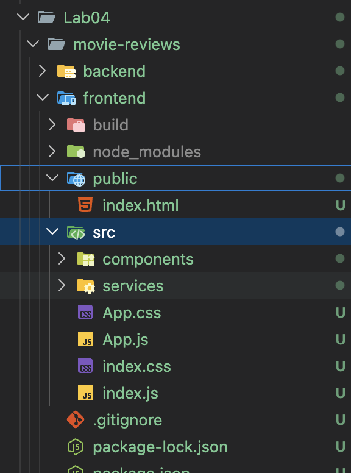
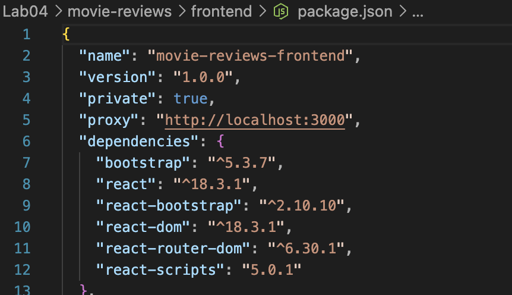
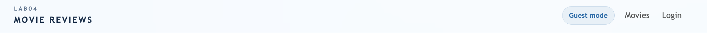
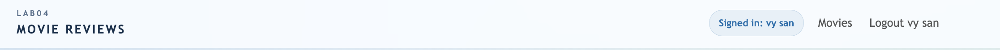
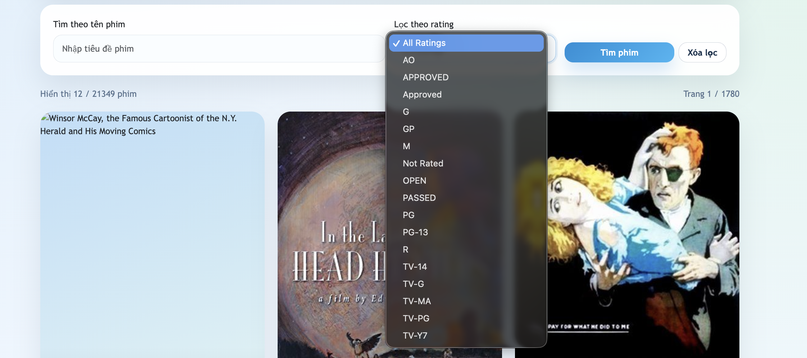
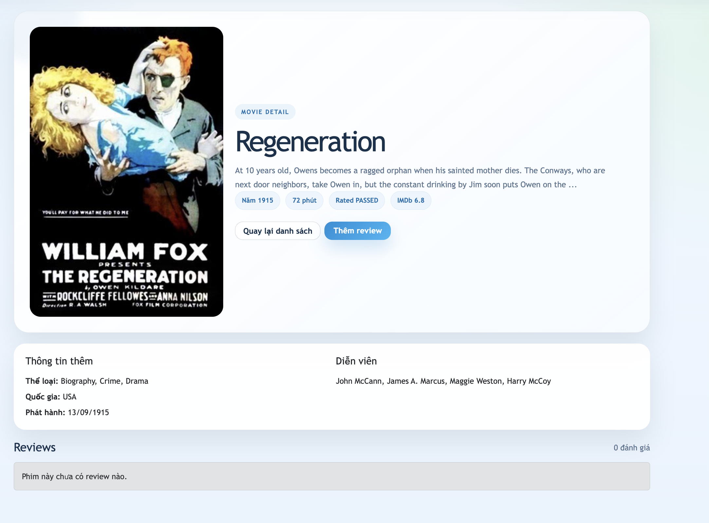
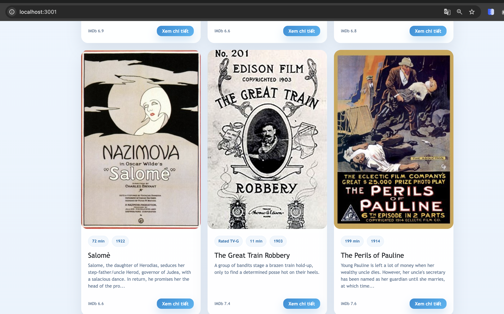
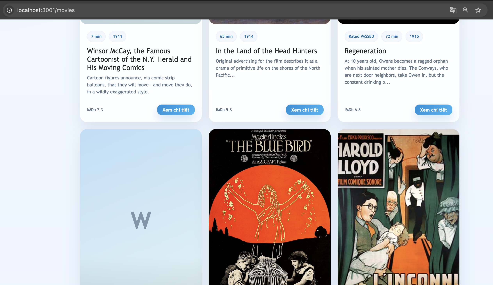
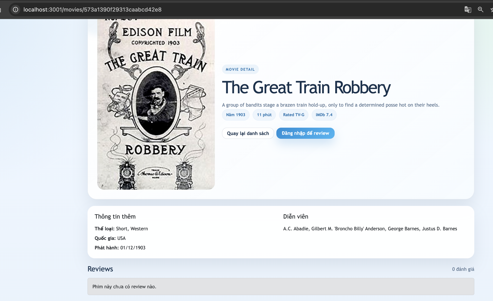
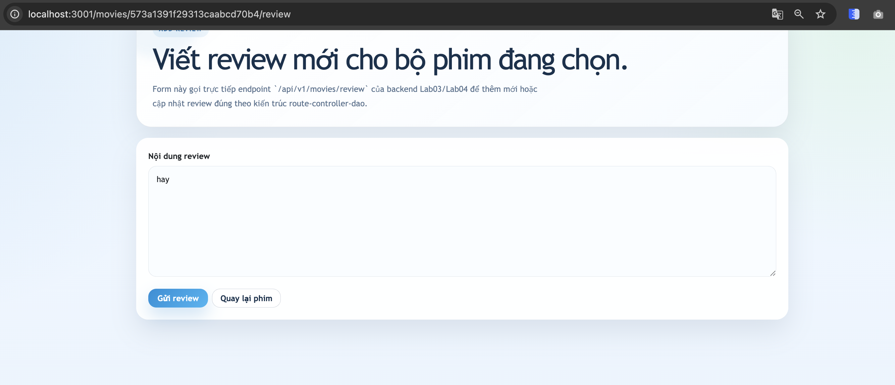

# Lab04 - Thiết lập Frontend với ReactJS

## 1. Thông tin sinh viên

| Họ tên                         | MSSV               | Lớp                |
| :------------------------------- | :----------------- | :------------------ |
| **Hồ Vương Tường Vy** | **23521827** | **IE213.Q21** |

## 2. Thông tin môn học

- Môn học: **IE213.Q21 - Kỹ thuật phát triển hệ thống web**

## 3. Nội dung bài thực hành

Lab04 tập trung vào việc xây dựng frontend cho ứng dụng **Movie Reviews** bằng **ReactJS** và kết nối với backend đã hoàn thiện từ Lab03.

Nội dung chính:

- tạo frontend cho dự án `movie-reviews`
- cài đặt `bootstrap`, `react-bootstrap`, `react-router-dom`
- xây dựng thanh điều hướng `Movie Reviews`
- quản lý trạng thái đăng nhập bằng React state
- thiết lập các route cho danh sách phim, chi tiết phim, thêm review và login
- kết nối frontend với backend để hiển thị phim và thao tác CRUD review

## 4. Cấu trúc thư mục chính

```text
Lab04/
├── BT4.1.2.pdf
├── HDBT4.2.2.pdf
├── README.md
└── movie-reviews/
    ├── backend/
    │   ├── api/
    │   ├── dao/
    │   ├── .env.example
    │   ├── index.js
    │   ├── package.json
    │   └── server.js
    ├── img/
    └── frontend/
        ├── public/
        │   └── index.html
        ├── src/
        │   ├── components/
        │   │   ├── add-review.js
        │   │   ├── login.js
        │   │   ├── movie.js
        │   │   └── movies-list.js
        │   ├── services/
        │   │   └── movies-data.service.js
        │   ├── App.css
        │   ├── App.js
        │   ├── index.css
        │   └── index.js
        └── package.json
```

## 5. Cách chạy chương trình

### 5.1 Chạy backend

```bash
cd Lab04/movie-reviews/backend
npm install
cp .env.example .env
```

Cấu hình file `.env`:

```env
MOVIEREVIEWS_DB_URI=<mongodb-atlas-uri>
MOVIEREVIEWS_NS=sample_mflix
PORT=3000
```

Chạy backend:

```bash
npm run dev
```

Hoặc:

```bash
npm start
```

### 5.2 Chạy frontend

```bash
cd Lab04/movie-reviews/frontend
npm install
PORT=3001 npm start
```

### 5.3 Kiểm tra nhanh

- Frontend: `http://localhost:3001`
- API movies: `http://localhost:3000/api/v1/movies`
- API ratings: `http://localhost:3000/api/v1/movies/ratings`

## 6. Chi tiết thực hiện

## Bài 1: Thiết lập frontend cho dự án Movie Reviews

### 1.1 Tạo frontend ReactJS

Thực hiện:

- tạo thư mục `frontend` trong `Lab04/movie-reviews`
- khởi tạo ứng dụng ReactJS để làm giao diện cho hệ thống Movie Reviews

Kết quả:

- frontend có thể chạy độc lập và kết nối với backend của Lab03/Lab04

Ảnh minh họa:



### 1.2 Cài đặt các package cần thiết

Thực hiện:

```bash
npm install bootstrap react-bootstrap react-router-dom
```

Kết quả:

- frontend có đủ thư viện để xây dựng UI và định tuyến giữa các trang

Ảnh minh họa:



## Bài 2: Xây dựng giao diện và các component chính

### 2.1 Xây dựng `App.js` và Navigation Bar

Thực hiện:

- tạo thanh điều hướng với logo `Movie Reviews`
- thêm menu `Movies`
- hiển thị trạng thái `Login/Logout` theo state người dùng
- lưu user vào `localStorage` để giữ trạng thái khi reload trang

Kết quả:

- ứng dụng có navigation bar hoạt động đúng và trạng thái đăng nhập được đồng bộ trên giao diện

Ảnh minh họa:





### 2.2 Tạo component `movies-list`

Thực hiện:

- gọi `GET /api/v1/movies` để lấy danh sách phim
- tìm kiếm theo `title`
- lọc phim theo `rating`
- hiển thị phân trang cơ bản

Kết quả:

- trang danh sách phim cho phép người dùng tìm kiếm và lọc phim trực tiếp từ frontend

Ảnh minh họa:




### 2.3 Tạo component `movie`

Thực hiện:

- gọi `GET /api/v1/movies/id/:id`
- hiển thị thông tin chi tiết phim
- hiển thị danh sách review của phim
- cho phép sửa và xóa review nếu đúng người dùng đã đăng nhập

Kết quả:

- người dùng có thể xem đầy đủ nội dung phim và danh sách review trong cùng một màn hình

Ảnh minh họa:



### 2.4 Tạo component `add-review`

Thực hiện:

- gọi `POST /api/v1/movies/review` để thêm review mới
- gọi `PUT /api/v1/movies/review` để cập nhật review
- điều hướng về trang chi tiết phim sau khi lưu thành công

Kết quả:

- chức năng thêm và sửa review hoạt động trực tiếp trên frontend

Ảnh minh họa:


### 2.5 Tạo component `login`

Thực hiện:

- nhập `name` và `id` để mô phỏng đăng nhập
- cập nhật React state của `user`
- điều hướng người dùng về trang trước đó sau khi login

Kết quả:

- frontend mô phỏng đúng yêu cầu login bằng state, không cần xác thực thật

Ảnh minh họa:


## Bài 3: Thiết lập routing cho frontend

### 3.1 Cấu hình `BrowserRouter`

Thực hiện:

- bọc toàn bộ ứng dụng bằng `BrowserRouter` trong `index.js`

Kết quả:

- frontend có thể điều hướng giữa các màn hình mà không reload toàn bộ trang

### 3.2 Cấu hình các route chính

Thực hiện:

- `/` và `/movies` -> `MoviesList`
- `/movies/:id` -> `Movie`
- `/movies/:id/review` -> `AddReview`
- `/login` -> `Login`

Kết quả:

- các component được điều hướng đúng theo yêu cầu bài thực hành

Ảnh minh họa:








