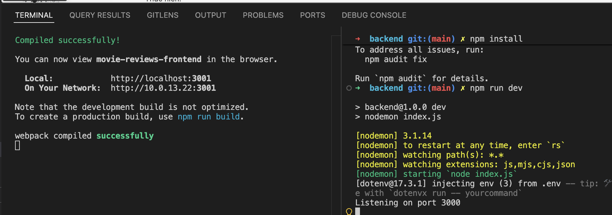
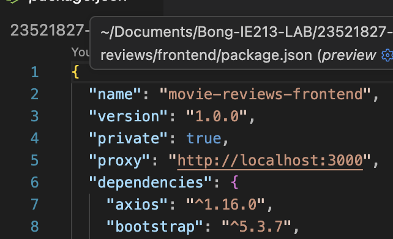
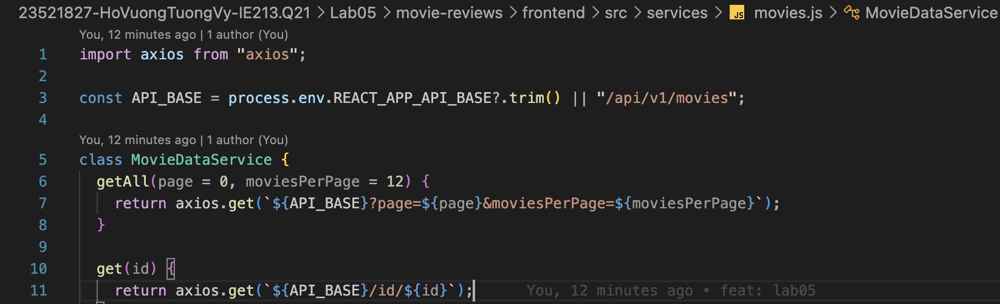
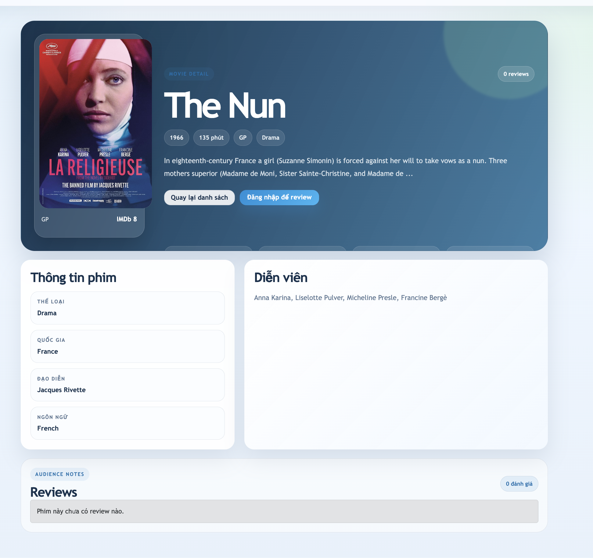
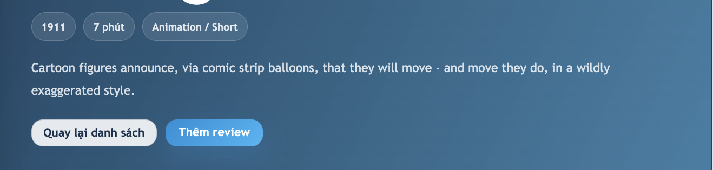
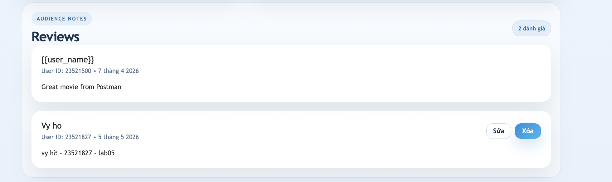
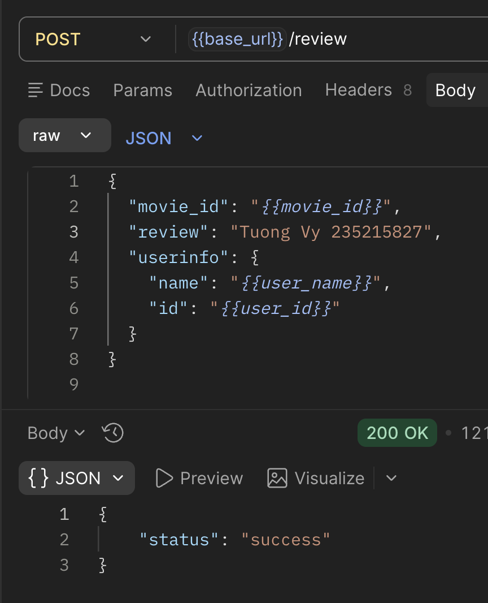

# Lab05 - Kết nối Frontend ReactJS với Backend Movie Reviews

## 1. Thông tin sinh viên

| Họ tên                         | MSSV               | Lớp                |
| :------------------------------- | :----------------- | :------------------ |
| **Hồ Vương Tường Vy** | **23521827** | **IE213.Q21** |

## 2. Thông tin môn học

- Môn học: **IE213.Q21 - Kỹ thuật phát triển hệ thống web**

## 3. Nội dung bài thực hành

Nội dung chính:

- cài đặt và sử dụng `axios` để frontend gọi API backend
- tạo lớp dịch vụ `MovieDataService` trong `src/services/movies.js`
- xây dựng các lời gọi `getAll()`, `get(id)`, `find()`, `createReview()`, `updateReview()`, `deleteReview()`, `getRatings()`
- xây dựng `MoviesList` với `useState()` và `useEffect()` để lấy danh sách phim và danh sách rating
- tạo form tìm kiếm theo `title` và lọc theo `rated`
- hiển thị danh sách phim bằng `Card` của `react-bootstrap`
- xây dựng trang chi tiết phim khi nhấn vào nút xem chi tiết/review
- hiển thị danh sách review tương ứng với từng phim
- dùng `momentjs` để định dạng ngày review
- giữ chức năng đăng nhập giả lập, thêm review, sửa review và xóa review từ Lab04

## 4. Cấu trúc thư mục chính

```text
Lab05/
├── BT5.1.2.pdf
├── HDBT5.2.2.pdf
├── README.md
└── movie-reviews/
    ├── backend/
    │   ├── api/
    │   │   ├── movies.controller.js
    │   │   ├── movies.route.js
    │   │   └── reviews.controller.js
    │   ├── dao/
    │   │   ├── moviesDAO.js
    │   │   └── reviewsDAO.js
    │   ├── .env.example
    │   ├── index.js
    │   ├── package.json
    │   └── server.js
    ├── frontend/
    │   ├── public/
    │   │   └── index.html
    │   ├── src/
    │   │   ├── components/
    │   │   │   ├── add-review.js
    │   │   │   ├── login.js
    │   │   │   ├── movie.js
    │   │   │   └── movies-list.js
    │   │   ├── services/
    │   │   │   └── movies.js
    │   │   ├── App.css
    │   │   ├── App.js
    │   │   ├── index.css
    │   │   └── index.js
    │   └── package.json
    └── img/
        └── <các ảnh minh họa chụp màn hình>
```

## 5. Cách chạy chương trình

### 5.1 Chạy backend

```bash
cd Lab05/movie-reviews/backend
npm install
cp .env.example .env
```

Cấu hình file `.env`:

```env
MOVIEREVIEWS_DB_URI=<mongodb-atlas-uri>
MOVIEREVIEWS_NS=sample_mflix
PORT=3000
```

Chạy backend:

```bash
npm run dev
```

Hoặc:

```bash
npm start
```

### 5.2 Chạy frontend

```bash
cd Lab05/movie-reviews/frontend
npm install
PORT=3001 npm start
```

Frontend dùng proxy trong `package.json` để gọi backend tại `http://localhost:3000`.

### 5.3 Kiểm tra nhanh

- Frontend: `http://localhost:3001`
- API movies: `http://localhost:3000/api/v1/movies`
- API ratings: `http://localhost:3000/api/v1/movies/ratings`
- API movie detail: `http://localhost:3000/api/v1/movies/id/<movie_id>`

Ảnh minh họa:



## 6. Chi tiết thực hiện

## Bài 1: Kết nối tới Backend

### 1.1 Cài đặt package `axios` và `moment`

Thực hiện:

```bash
cd Lab05/movie-reviews/frontend
npm install axios moment
```

Kết quả:

- frontend có `axios` để gọi API backend
- frontend có `moment` để định dạng ngày review theo yêu cầu Lab05

Mã chính trong `package.json`:

```json
{
  "dependencies": {
    "axios": "^1.16.0",
    "moment": "^2.30.1",
    "react": "^18.3.1",
    "react-bootstrap": "^2.10.10",
    "react-router-dom": "^6.30.1"
  }
}
```

Ảnh minh họa:



### 1.2 Tạo lớp dịch vụ `MovieDataService`

File thực hiện: `movie-reviews/frontend/src/services/movies.js`

Các phương thức đã xây dựng:

- `getAll(page, moviesPerPage)`: lấy danh sách phim
- `get(id)`: lấy chi tiết phim theo id
- `find(query, by, page, moviesPerPage)`: tìm phim theo `title` hoặc `rated`
- `createReview(data)`: thêm review mới
- `updateReview(data)`: cập nhật review
- `deleteReview(id, userId)`: xóa review theo `review_id` và `user_id`
- `getRatings()`: lấy danh sách rating

Mã chính:

```javascript
import axios from "axios";

const API_BASE = process.env.REACT_APP_API_BASE?.trim() || "/api/v1/movies";

class MovieDataService {
  getAll(page = 0, moviesPerPage = 12) {
    return axios.get(`${API_BASE}?page=${page}&moviesPerPage=${moviesPerPage}`);
  }

  get(id) {
    return axios.get(`${API_BASE}/id/${id}`);
  }

  find(query, by = "title", page = 0, moviesPerPage = 12) {
    const params = new URLSearchParams({
      [by]: query,
      page: page.toString(),
      moviesPerPage: moviesPerPage.toString(),
    });

    return axios.get(`${API_BASE}?${params.toString()}`);
  }

  createReview(data) {
    return axios.post(`${API_BASE}/review`, data);
  }

  updateReview(data) {
    return axios.put(`${API_BASE}/review`, data);
  }

  deleteReview(id, userId) {
    return axios.delete(`${API_BASE}/review`, {
      data: {
        review_id: id,
        user_id: userId,
      },
    });
  }

  getRatings() {
    return axios.get(`${API_BASE}/ratings`);
  }
}

const movieDataService = new MovieDataService();

export default movieDataService;
```

Kết quả:

- các component frontend không gọi API trực tiếp mà thông qua service riêng
- service dùng chung base path `/api/v1/movies` và tận dụng proxy của React khi chạy development

Ảnh minh họa:



## Bài 2: Xây dựng `MoviesList` Component

### 2.1 Khai báo state bằng `useState()`

File thực hiện: `movie-reviews/frontend/src/components/movies-list.js`

Các state chính:

- `movies`: danh sách phim đang hiển thị
- `ratings`: danh sách rating lấy từ backend
- `title`: giá trị ô tìm kiếm theo tên phim
- `rated`: rating đang chọn
- `activeFilters`: bộ lọc đang áp dụng
- `page` và `totalResults`: phục vụ phân trang
- `loading` và `error`: quản lý trạng thái giao diện

Mã chính:

```javascript
const [movies, setMovies] = React.useState([]);
const [ratings, setRatings] = React.useState([ALL_RATINGS]);
const [title, setTitle] = React.useState("");
const [rated, setRated] = React.useState(ALL_RATINGS);
const [activeFilters, setActiveFilters] = React.useState({
  title: "",
  rated: "",
});
const [page, setPage] = React.useState(0);
const [totalResults, setTotalResults] = React.useState(0);
const [loading, setLoading] = React.useState(true);
const [error, setError] = React.useState("");
```

### 2.2 Lấy dữ liệu bằng `useEffect()`

Thực hiện:

- gọi `MovieDataService.getRatings()` khi component được render lần đầu
- gọi `MovieDataService.getAll()` hoặc `MovieDataService.find()` khi trang hoặc bộ lọc thay đổi

Mã chính:

```javascript
React.useEffect(() => {
  async function loadRatings() {
    try {
      const ratingsResponse = await MovieDataService.getRatings();
      setRatings([ALL_RATINGS, ...ratingsResponse.data.filter(Boolean).sort()]);
    } catch (requestError) {
      setError(requestError.message);
    }
  }

  loadRatings();
}, []);

React.useEffect(() => {
  async function loadMovies() {
    setLoading(true);
    setError("");

    try {
      const response = activeFilters.title
        ? await MovieDataService.find(activeFilters.title, "title", page, MOVIES_PER_PAGE)
        : activeFilters.rated
          ? await MovieDataService.find(activeFilters.rated, "rated", page, MOVIES_PER_PAGE)
          : await MovieDataService.getAll(page, MOVIES_PER_PAGE);

      setMovies(response.data.movies || []);
      setTotalResults(response.data.total_results || 0);
    } catch (requestError) {
      setMovies([]);
      setTotalResults(0);
      setError(requestError.message);
    } finally {
      setLoading(false);
    }
  }

  loadMovies();
}, [page, activeFilters]);
```

Kết quả:

- danh sách phim được tải tự động khi mở trang
- danh sách rating được lấy từ collection `movies` thông qua endpoint `/ratings`

Ảnh minh họa:


### 2.3 Tạo search form

Thực hiện:

- tạo input tìm kiếm theo `title`
- tạo select lọc theo `rated`
- nút `Tìm title` áp dụng tìm kiếm theo tiêu đề
- nút `Tìm rating` áp dụng lọc theo rating
- nút `Xóa lọc` đưa giao diện về danh sách mặc định

Mã chính:

```javascript
function findByTitle(event) {
  event?.preventDefault();
  setPage(0);
  setActiveFilters({
    title: title.trim(),
    rated: "",
  });
}

function findByRating() {
  setPage(0);
  setActiveFilters({
    title: "",
    rated: rated === ALL_RATINGS ? "" : rated,
  });
}
```

Kết quả:

- người dùng có thể tìm phim theo tên
- người dùng có thể lọc phim theo rating như `G`, `PG`, `PG-13`, `R`, ...

Ảnh minh họa:

- Filter theo title:


- Filter theo rating


### 2.4 Hiển thị danh sách phim bằng `Card`

Thực hiện:

- mỗi phim hiển thị poster, title, rating, runtime, year, plot ngắn và IMDb rating
- dùng `Card`, `Row`, `Col`, `Button` của `react-bootstrap`
- nút `Xem chi tiết` điều hướng đến `/movies/:id`

Mã chính:

```javascript
<Row className="g-4">
  {movies.map((movie) => (
    <Col lg={4} md={6} key={movie._id}>
      <Card className="movie-card border-0 h-100 overflow-hidden">
        <MoviePoster movie={movie} />
        <Card.Body className="p-4 d-flex flex-column">
          <Card.Title className="fs-4">{movie.title}</Card.Title>
          <Card.Text className="muted-text flex-grow-1">
            {movie.plot
              ? `${movie.plot.slice(0, 160)}${movie.plot.length > 160 ? "..." : ""}`
              : "Chưa có mô tả cho bộ phim này."}
          </Card.Text>
          <Button as={Link} to={`/movies/${movie._id}`} className="btn-accent">
            Xem chi tiết
          </Button>
        </Card.Body>
      </Card>
    </Col>
  ))}
</Row>
```

Kết quả:

- danh sách phim được trình bày dạng card responsive
- giao diện hoạt động tốt trên desktop và mobile

Ảnh minh họa:


## Bài 3: Hiển thị trang chi tiết Movie

### 3.1 Xây dựng component `Movie`

File thực hiện: `movie-reviews/frontend/src/components/movie.js`

State chính:

- `movie`: lưu thông tin chi tiết phim gồm `_id`, `title`, `rated`, `poster`, `plot`, `reviews`, ...
- `loading`: trạng thái đang tải dữ liệu
- `error`: lỗi khi gọi API
- `busyReviewId`: review đang được xử lý khi xóa

Mã chính:

```javascript
const { id } = useParams();
const navigate = useNavigate();
const [movie, setMovie] = React.useState(null);
const [loading, setLoading] = React.useState(true);
const [error, setError] = React.useState("");
const [busyReviewId, setBusyReviewId] = React.useState("");
```

### 3.2 Gọi service lấy chi tiết phim

Thực hiện:

- lấy `id` từ route `/movies/:id` bằng `useParams()`
- gọi `MovieDataService.get(id)`
- lưu dữ liệu trả về vào state `movie`

Mã chính:

```javascript
const loadMovie = React.useCallback(async () => {
  setLoading(true);
  setError("");

  try {
    const response = await MovieDataService.get(id);
    setMovie(response.data);
  } catch (requestError) {
    setError(requestError.message);
    setMovie(null);
  } finally {
    setLoading(false);
  }
}, [id]);

React.useEffect(() => {
  loadMovie();
}, [loadMovie]);
```

Kết quả:

- khi nhấn `Xem chi tiết`, frontend hiển thị đúng thông tin phim được lấy từ backend

Ảnh minh họa:



### 3.3 Trang trí giao diện chi tiết phim

Thực hiện:

- hiển thị poster, title, plot, year, runtime, rated, IMDb rating
- hiển thị thông tin thể loại, quốc gia, ngày phát hành và diễn viên
- có nút quay lại danh sách phim
- nếu đã đăng nhập, hiển thị nút thêm review
- nếu chưa đăng nhập, hiển thị nút đăng nhập để review

Mã chính:

```javascript
<Button as={Link} to="/movies" className="btn-outline-soft">
  Quay lại danh sách
</Button>
{user ? (
  <Button as={Link} to={`/movies/${movie._id}/review`} className="btn-accent">
    Thêm review
  </Button>
) : (
  <Button as={Link} to="/login" state={{ from: `/movies/${movie._id}/review` }} className="btn-accent">
    Đăng nhập để review
  </Button>
)}
```

Kết quả:

- trang chi tiết phim rõ ràng và có đầy đủ đường dẫn thao tác review

Ảnh minh họa:



## Bài 4: Hiển thị danh sách review cho từng phim

### 4.1 Hiển thị review bên dưới phần nội dung phim

Thực hiện:

- đọc mảng `movie.reviews` từ API chi tiết phim
- dùng `Card` để hiển thị từng review
- mỗi review gồm tên người viết, user id, ngày viết và nội dung review

Mã chính:

```javascript
{movie.reviews?.length ? (
  movie.reviews.map((review) => (
    <Card key={review._id} className="review-card border-0">
      <Card.Body className="p-4">
        <div className="review-header">
          <div>
            <h3 className="h5 mb-1">{review.name || "Ẩn danh"}</h3>
            <div className="review-byline">
              User ID: {review.user_id || "N/A"} • {formatDate(review.date)}
            </div>
          </div>
        </div>
        <p className="mb-0 mt-3">{review.text || "Review rỗng."}</p>
      </Card.Body>
    </Card>
  ))
) : (
  <Alert variant="secondary" className="mb-0">
    Phim này chưa có review nào.
  </Alert>
)}
```

Kết quả:

- các review liên quan đến phim được hiển thị ngay trong trang chi tiết

Ảnh minh họa:



### 4.2 Thêm, sửa và xóa review

Thực hiện:

- component `add-review.js` gọi `MovieDataService.createReview()` để thêm review
- khi sửa review, component gọi `MovieDataService.updateReview()`
- khi xóa review, component `movie.js` gọi `MovieDataService.deleteReview()`
- chỉ user có `id` trùng với `review.user_id` mới thấy nút sửa/xóa review của mình

Mã chính thêm/sửa review trong `add-review.js`:

```javascript
if (editingReview) {
  await MovieDataService.updateReview({
    review_id: editingReview._id,
    user_id: user.id,
    review: review.trim(),
  });
} else {
  await MovieDataService.createReview({
    movie_id: id,
    review: review.trim(),
    userinfo: {
      name: user.name,
      id: user.id,
    },
  });
}

navigate(`/movies/${id}`);
```

Mã chính xóa review trong `movie.js`:

```javascript
async function handleDelete(reviewId) {
  const confirmed = window.confirm("Bạn có chắc muốn xóa review này?");
  if (!confirmed || !user) {
    return;
  }

  setBusyReviewId(reviewId);
  setError("");

  try {
    await MovieDataService.deleteReview(reviewId, user.id);
    await loadMovie();
  } catch (requestError) {
    setError(requestError.message);
  } finally {
    setBusyReviewId("");
  }
}
```

Kết quả:

- thao tác CRUD review được kết nối từ frontend đến backend
- backend kiểm tra `user_id` khi cập nhật hoặc xóa review

Ảnh minh họa:



### 4.3 Định dạng ngày review bằng `momentjs`

Thực hiện:

- import `moment` trong `movie.js`
- thiết lập locale tiếng Việt
- format ngày bằng `moment(review.date).format("Do MMMM YYYY")`

Mã chính:

```javascript
import moment from "moment";
import "moment/locale/vi";

moment.locale("vi");

function formatDate(value) {
  if (!value) {
    return "Không rõ thời gian";
  }

  const date = moment(value);
  return date.isValid() ? date.format("Do MMMM YYYY") : "Không rõ thời gian";
}
```

Kết quả:

- Ngày review được hiển thị dễ đọc theo yêu cầu Lab05

Ảnh minh họa:


## 7. Kết luận

Lab05 đã được hoàn thiện trong thư mục riêng `Lab05`. Source code kế thừa backend/frontend từ Lab04 nhưng đã chỉnh lại frontend đúng trọng tâm Lab05: gọi backend bằng `axios`, dùng service `MovieDataService`, xây dựng danh sách phim, tìm kiếm/lọc phim, trang chi tiết phim, hiển thị review và định dạng ngày bằng `momentjs`.
