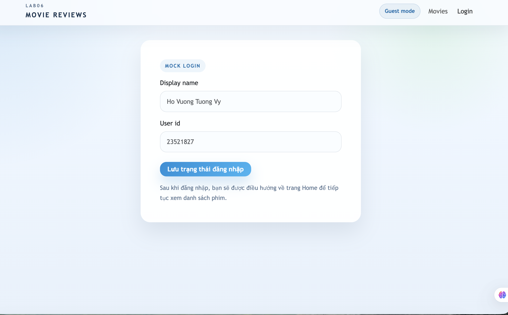
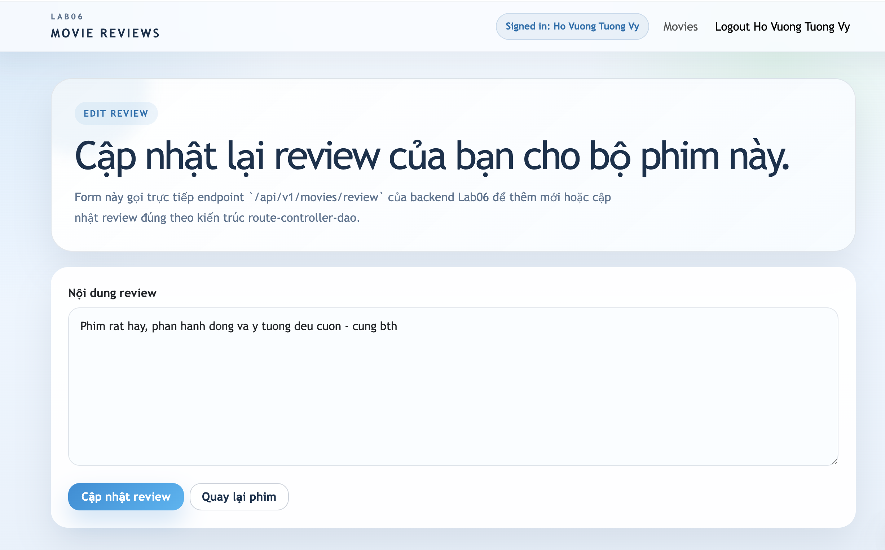
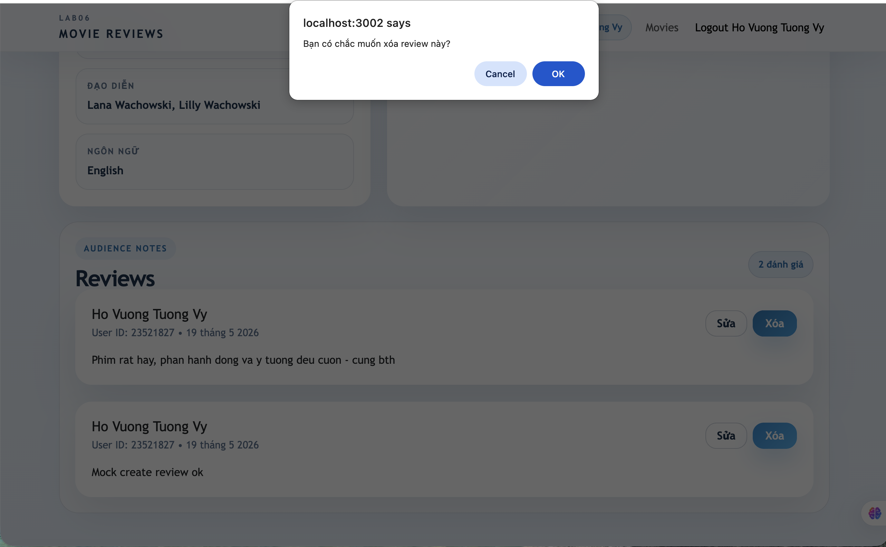
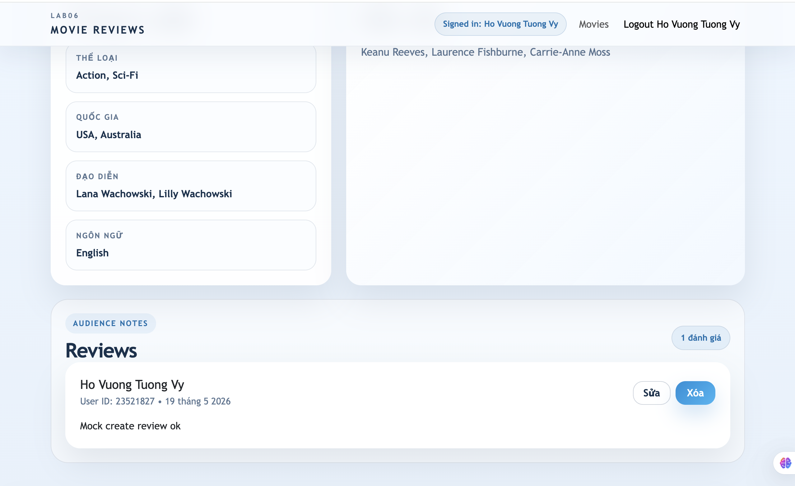
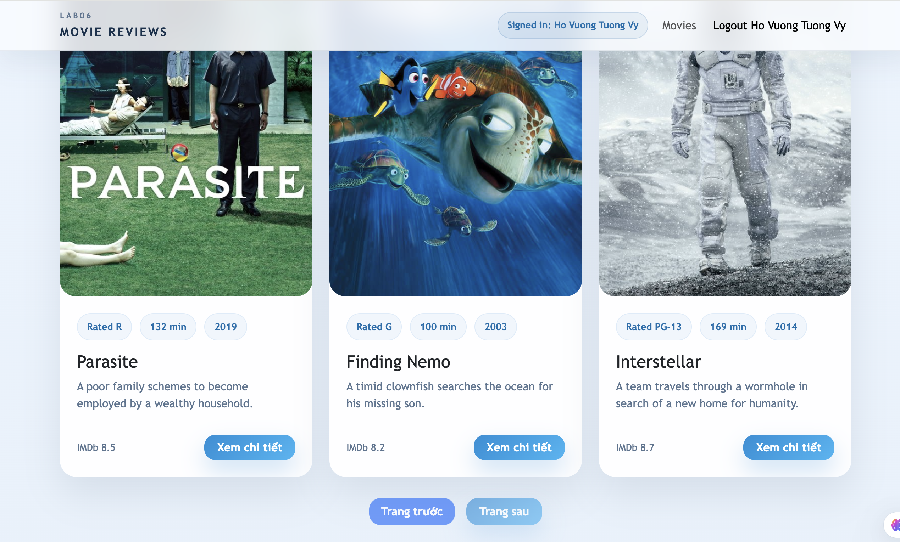
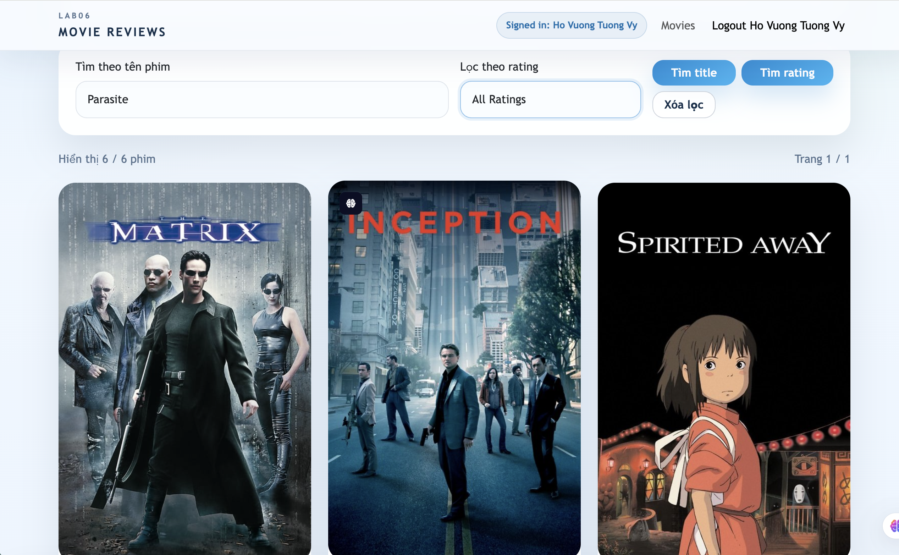
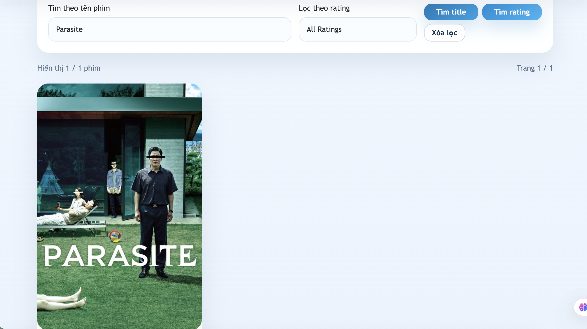

# Lab06 - Xây dựng Frontend với ReactJS (tt)

## 1. Thông tin sinh viên

| Họ tên                         | MSSV               | Lớp                |
| :------------------------------- | :----------------- | :------------------ |
| **Hồ Vương Tường Vy** | **23521827** | **IE213.Q21** |

## 2. Thông tin môn học

- Môn học: **IE213.Q21 - Kỹ thuật phát triển hệ thống web**
- Bài thực hành: **Bài thực hành 6 - Xây dựng Frontend với ReactJS (tt)**

## 3. Mục tiêu

Theo yêu cầu trong file `BT6.1.2.pdf`, bài thực hành giúp sinh viên hiểu cách MERN stack hoạt động thông qua các sự kiện:

- thêm, xóa, sửa review từ frontend
- lấy dữ liệu movie theo từng trang
- tìm kiếm movie theo `Title`
- lọc movie theo `Rating`

## 4. Cấu trúc thư mục chính

```text
Lab06/
├── BT6.1.2.pdf
├── HDBT6.2.2.pdf
├── README.md
└── movie-reviews/
    ├── backend/
    │   ├── api/
    │   │   ├── movies.controller.js
    │   │   ├── movies.route.js
    │   │   └── reviews.controller.js
    │   ├── dao/
    │   │   ├── moviesDAO.js
    │   │   └── reviewsDAO.js
    │   ├── data/
    │   │   └── mockData.js
    │   ├── index.js
    │   ├── package.json
    │   └── server.js
    └── frontend/
        ├── public/
        │   ├── index.html
        │   └── posters/
        ├── src/
        │   ├── components/
        │   │   ├── add-review.js
        │   │   ├── login.js
        │   │   ├── movie.js
        │   │   └── movies-list.js
        │   ├── services/
        │   │   └── movies.js
        │   ├── App.css
        │   ├── App.js
        │   ├── index.css
        │   └── index.js
        └── package.json
```

## 5. Cách chạy chương trình

### 5.1 Chạy backend

```bash
cd Lab06/movie-reviews/backend
npm install
npm start
```

Backend chạy tại:

```text
http://localhost:3000
```

File `.env` có thể dùng dữ liệu mẫu:

```env
PORT=3000
USE_MOCK_DATA=true
```

Hoặc dùng MongoDB Atlas:

```env
MOVIEREVIEWS_DB_URI=<mongodb-atlas-uri>
MOVIEREVIEWS_NS=sample_mflix
PORT=3000
USE_MOCK_DATA=false
```

### 5.2 Chạy frontend

```bash
cd Lab06/movie-reviews/frontend
npm install
npm start
```

Frontend chạy tại:

```text
http://localhost:3001
```

Frontend gọi backend tại:

```text
http://localhost:3000/api/v1/movies
```

## 6. Bài 1: Thêm và Sửa Review

### 6.1 Tạo login component

File thực hiện:

```text
movie-reviews/frontend/src/components/login.js
```

Yêu cầu đề bài:

- khi người dùng đăng nhập thành công, họ sẽ thấy được chức năng `Edit` và `Delete` review của chính họ
- sau khi login thành công, người dùng được redirect về trang Home



Mã chính:

```javascript
async function handleSubmit(event) {
  event.preventDefault();

  if (!name.trim() || !id.trim()) {
    setError("Cần nhập đầy đủ name và id để mô phỏng đăng nhập.");
    return;
  }

  await login({
    name: name.trim(),
    id: id.trim(),
  });

  navigate("/movies", { replace: true });
}
```

Trong `App.js`, user được lưu lại bằng `localStorage`:

```javascript
const STORAGE_KEY = "movie_reviews_user";
const [user, setUser] = React.useState(getInitialUser);
```

Kết quả:

- người dùng đăng nhập bằng `name` và `id`
- sau khi đăng nhập thành công, ứng dụng chuyển về `/movies`
- `user` được truyền từ `App.js` xuống các component cần dùng

### 6.2 Thêm review

File thực hiện:

```text
movie-reviews/frontend/src/components/add-review.js
```


Các biến được tạo theo yêu cầu:

```javascript
const editingReview = location.state?.currentReview || location.state?.review || null;
const editing = Boolean(editingReview);
const initialReviewState = React.useMemo(
  () => ({
    review: editing ? editingReview?.review || editingReview?.text || "" : "",
  }),
  [editing, editingReview],
);

const [review, setReview] = React.useState(initialReviewState);
const [submitted, setSubmitted] = React.useState(false);
```

Ý nghĩa:

- `editing` có giá trị `true` khi component đang ở chế độ chỉnh sửa
- nếu `editing` là `false` thì component ở chế độ thêm review
- `review` được thiết lập từ `initialReviewState`
- trong chế độ editing, `initialReviewState` chứa nội dung review hiện tại
- `submitted` theo dõi việc thêm review mới thành công

Hàm `onChangeReview()` theo dõi dữ liệu nhập trong form:

```javascript
function onChangeReview(event) {
  const value = event.target.value;

  setReview((currentReview) => ({
    ...currentReview,
    review: value,
  }));
}
```

Hàm `saveReview()` được gọi khi submit form. Trong hàm này tạo object `data` chứa thông tin review:

```javascript
const data = {
  review: review.review.trim(),
  name: user.name,
  user_id: user.id,
  movie_id: id,
};
```

Trong đó:

- `name` nhận từ props `user` được gửi từ `App.js`
- `user_id` nhận từ props `user` được gửi từ `App.js`
- `movie_id` lấy trực tiếp từ URL bằng `useParams()`
- `review` lấy từ nội dung form

Khi thêm mới review, frontend gọi:

```javascript
await MovieDataService.createReview(data);
setSubmitted(true);
```

Trong service:

```javascript
createReview(data) {
  return axios.post(`${API_BASE}/review`, data);
}
```

Định tuyến backend:

```javascript
router
  .route("/review")
  .post(ReviewsController.apiPostReview)
```

Controller backend gọi:

```javascript
ReviewsController.apiPostReview()
```

Kết quả:

- người dùng đã đăng nhập có thể thêm review mới
- dữ liệu review được gửi lên backend bằng request body

### 6.3 Sửa review



File liên quan:

```text
movie-reviews/frontend/src/components/movie.js
movie-reviews/frontend/src/components/add-review.js
```

Trong `movie.js`, khi bấm nút `Sửa`, review hiện tại được truyền qua `state` với thuộc tính `currentReview`:

```javascript
navigate(`/movies/${movie._id}/review`, {
  state: { currentReview: review },
});
```

Trong `add-review.js`, component kiểm tra state truyền vào:

```javascript
const editingReview = location.state?.currentReview || location.state?.review || null;
const editing = Boolean(editingReview);
```

Nếu có `currentReview`, `editing` chuyển thành `true` và `initialReviewState` lấy nội dung review hiện tại:

```javascript
review: editing ? editingReview?.review || editingReview?.text || "" : ""
```

Nếu `editing` là `true`, frontend gọi:

```javascript
await MovieDataService.updateReview({
  ...data,
  review_id: editingReview._id,
});
```

Trong service:

```javascript
updateReview(data) {
  return axios.put(`${API_BASE}/review`, data);
}
```

Định tuyến backend:

```javascript
router
  .route("/review")
  .put(ReviewsController.apiUpdateReview)
```

Controller backend gọi:

```javascript
ReviewsController.apiUpdateReview()
```

Kết quả:

- ứng dụng cho phép cập nhật lại review
- chỉ review của user hiện tại mới hiển thị nút sửa

## 7. Bài 2: Xóa review

Trước khi xóa: 



Sau khi xóa: 



File thực hiện:

```text
movie-reviews/frontend/src/components/movie.js
```

Yêu cầu đề bài:

- trong nút delete, truyền `review id` và `index` nhận được từ `movie.reviews.map()` vào phương thức `deleteReview()`
- trong `deleteReview()`, gọi hàm `deleteReview()` trong `MovieDataService`
- tạo callback `.then()` sau khi gọi delete xong
- trong callback, lấy mảng reviews hiện tại, dùng `splice(index, 1)` để xóa review
- cập nhật lại mảng reviews như trạng thái mới

Mã nút delete:

```javascript
{movie.reviews?.length ? (
  movie.reviews.map((review, index) => (
    <Button
      className="btn-accent"
      disabled={busyReviewId === review._id}
      onClick={() => deleteReview(review._id, index)}
    >
      {busyReviewId === review._id ? "Đang xóa..." : "Xóa"}
    </Button>
  ))
) : null}
```

Mã hàm `deleteReview()`:

```javascript
function deleteReview(reviewId, index) {
  const confirmed = window.confirm("Bạn có chắc muốn xóa review này?");
  if (!confirmed || !user) {
    return;
  }

  setBusyReviewId(reviewId);
  setError("");

  MovieDataService.deleteReview(reviewId, user.id)
    .then(() => {
      setMovie((previousMovie) => {
        if (!previousMovie) {
          return previousMovie;
        }

        const nextReviews = [...(previousMovie.reviews || [])];
        nextReviews.splice(index, 1);

        return {
          ...previousMovie,
          reviews: nextReviews,
        };
      });
    })
    .catch((requestError) => {
      setError(requestError.message);
    })
    .finally(() => {
      setBusyReviewId("");
    });
}
```

Trong service:

```javascript
deleteReview(id, userId) {
  return axios.delete(`${API_BASE}/review`, {
    data: {
      review_id: id,
      user_id: userId,
    },
  });
}
```

Kết quả:

- người dùng đăng nhập vào movie cụ thể có review của mình
- bấm `Xóa` sẽ gọi backend để xóa review
- review bị xóa khỏi giao diện ngay sau khi request thành công

## 8. Bài 3: Lấy dữ liệu cho trang tiếp theo



### 8.1 getAll()

File thực hiện:

```text
movie-reviews/frontend/src/components/movies-list.js
```

Yêu cầu đề bài:

- thêm 2 biến trạng thái `currentPage` và `entriesPerPage`
- thiết lập 2 biến trạng thái này trong phương thức `retrieveMovies()`
- thêm `useEffect()` để gọi lấy dữ liệu khi `currentPage` thay đổi
- truyền `currentPage` vào lời gọi lấy dữ liệu trong `MovieDataService`
- thêm phần xử lý vào `return()`

Các state chính:

```javascript
const [currentPage, setCurrentPage] = React.useState(0);
const [entriesPerPage, setEntriesPerPage] = React.useState(DEFAULT_ENTRIES_PER_PAGE);
```

Hàm lấy dữ liệu trang hiện tại:

```javascript
const retrieveNextPage = React.useCallback(async () => {
  setLoading(true);
  setError("");

  try {
    const response =
      currentSearchMode === SEARCH_MODES.findByTitle && activeFilters.title
        ? await MovieDataService.find(activeFilters.title, "title", currentPage, entriesPerPage)
        : currentSearchMode === SEARCH_MODES.findByRating && activeFilters.rated
          ? await MovieDataService.find(activeFilters.rated, "rated", currentPage, entriesPerPage)
          : await MovieDataService.getAll(currentPage, entriesPerPage);

    setMovies(response.data.movies || []);
    setCurrentPage(response.data.page || 0);
    setEntriesPerPage(response.data.entries_per_page || DEFAULT_ENTRIES_PER_PAGE);
    setTotalResults(response.data.total_results || 0);
  } catch (requestError) {
    setMovies([]);
    setTotalResults(0);
    setError(requestError.message);
  } finally {
    setLoading(false);
  }
}, [activeFilters, currentPage, currentSearchMode, entriesPerPage]);
```

`useEffect()` gọi lại khi trang hoặc chế độ tìm kiếm thay đổi:

```javascript
React.useEffect(() => {
  retrieveNextPage();
}, [retrieveNextPage]);
```

Phần `return()` có nút chuyển trang:

```javascript
<Button
  className="btn-outline-soft"
  disabled={currentPage === 0 || loading}
  onClick={() => setCurrentPage((page) => Math.max(page - 1, 0))}
>
  Trang trước
</Button>

<Button
  className="btn-accent"
  disabled={loading || currentPage + 1 >= totalPages}
  onClick={() =>
    setCurrentPage((page) =>
      page + 1 < totalPages ? page + 1 : page,
    )
  }
>
  Trang sau
</Button>
```

Trong service:

```javascript
getAll(page = 0, moviesPerPage = 12) {
  return axios.get(`${API_BASE}?page=${page}&moviesPerPage=${moviesPerPage}`);
}
```

Kết quả:

- khi `currentPage` thay đổi, frontend gọi API lấy dữ liệu trang tương ứng
- trang hiện tại được hiển thị trên giao diện

### 8.2 find()



Kết quả sau khi tìm kiếm:



File thực hiện:

```text
movie-reviews/frontend/src/components/movies-list.js
```

Yêu cầu đề bài:

- tạo biến trạng thái `currentSearchMode` nhận 2 giá trị `findByTitle` hoặc `findByRating`
- dùng `useEffect()` để khi `currentSearchMode` thay đổi thì đưa `currentPage` về `0`
- tạo phương thức `retrieveNextPage()` dựa vào `currentSearchMode` để gọi hàm tương ứng
- thêm tham số `currentPage` vào lời gọi `MovieDataService.find()`
- thêm `setCurrentSearchMode()` vào các phương thức điều khiển `retrieveMovies()`, `findByTitle()`, `findByRating()`

Các chế độ tìm kiếm:

```javascript
const SEARCH_MODES = {
  retrieveMovies: "retrieveMovies",
  findByTitle: "findByTitle",
  findByRating: "findByRating",
};

const [currentSearchMode, setCurrentSearchMode] = React.useState(
  SEARCH_MODES.retrieveMovies,
);
```

Khi chế độ tìm kiếm thay đổi, đưa trang hiện tại về `0`:

```javascript
React.useEffect(() => {
  setCurrentPage(0);
}, [currentSearchMode]);
```

Hàm `retrieveMovies()` dùng cho lấy tất cả movie:

```javascript
function retrieveMovies() {
  setCurrentSearchMode(SEARCH_MODES.retrieveMovies);
  setCurrentPage(0);
  setActiveFilters({
    title: "",
    rated: "",
  });
}
```

Hàm tìm theo title:

```javascript
function findByTitle(event) {
  event?.preventDefault();
  setCurrentSearchMode(SEARCH_MODES.findByTitle);
  setCurrentPage(0);
  setActiveFilters({
    title: title.trim(),
    rated: "",
  });
}
```

Hàm tìm theo rating:

```javascript
function findByRating() {
  setCurrentSearchMode(SEARCH_MODES.findByRating);
  setCurrentPage(0);
  setActiveFilters({
    title: "",
    rated: rated === ALL_RATINGS ? "" : rated,
  });
}
```

Trong service, hàm `find()` nhận thêm `page`:

```javascript
find(query, by = "title", page = 0, moviesPerPage = 12) {
  const params = new URLSearchParams({
    [by]: query,
    page: page.toString(),
    moviesPerPage: moviesPerPage.toString(),
  });

  return axios.get(`${API_BASE}?${params.toString()}`);
}
```

Kết quả:

- khi tìm theo title, các trang tiếp theo vẫn giữ chế độ tìm theo title
- khi lọc theo rating, các trang tiếp theo vẫn giữ chế độ lọc theo rating
- khi chuyển chế độ tìm kiếm, `currentPage` được đưa về trang đầu tiên

## 9. Backend liên quan

Route review trong backend:

```javascript
router
  .route("/review")
  .post(ReviewsController.apiPostReview)
  .put(ReviewsController.apiUpdateReview)
  .delete(ReviewsController.apiDeleteReview);
```

Các phương thức controller:

- `apiPostReview()`: nhận dữ liệu từ request body để thêm review
- `apiUpdateReview()`: nhận dữ liệu từ request body để sửa review
- `apiDeleteReview()`: nhận `review_id` và `user_id` để xóa review

DAO kiểm tra `user_id` khi sửa hoặc xóa review, giúp user chỉ thao tác được trên review của chính mình.

## 10. Kết quả

Sau khi hoàn thành Lab06:

- đăng nhập thành công sẽ quay về trang Home
- user đăng nhập thấy nút `Sửa` và `Xóa` trên review của chính mình
- thêm review gọi `createReview(data)` trong `MovieDataService`
- sửa review gọi `updateReview(data)` trong `MovieDataService`
- xóa review gọi `deleteReview()` trong `MovieDataService` và cập nhật lại state bằng `splice()`
- danh sách movie có thể lấy trang tiếp theo bằng `currentPage`
- tìm kiếm theo title và rating vẫn hoạt động khi chuyển trang
