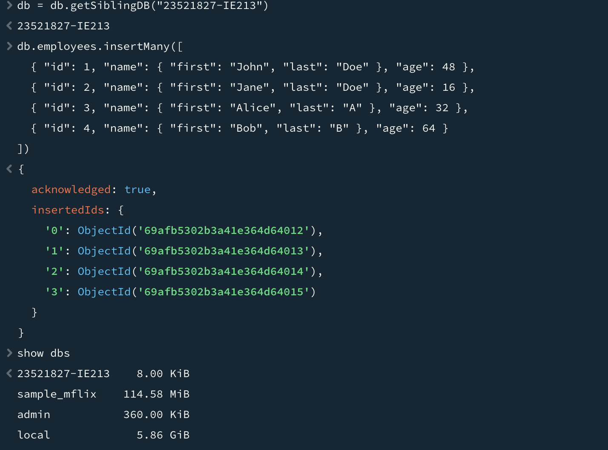

# 23521827-HoVuongTuongVy-IE213.Q21.2

## Liste des labs
- **Lab 1** – CRUD avec MongoDB (Atlas, Compass, Mongosh)

## Description du Lab 1
- TP axé sur les opérations CRUD (Create, Read, Update, Delete) avec MongoDB.
- Objectifs : déployer une base dans le cloud, connecter un outil de gestion, pratiquer l’ajout, la recherche, la mise à jour, la suppression et quelques stats simples (somme, moyenne) sur les documents.

## Comment exécuter
1) **Préparer l’environnement**
   - Créer un cluster gratuit sur MongoDB Atlas.
   - Charger les données d’exemple (sample data) et installer MongoDB Compass.
   - Utiliser la chaîne de connexion pour relier Compass au cluster Atlas.

2) **Utiliser la ligne de commande**
   - Ouvrir `mongosh` intégré à MongoDB Compass (ou Mongo Shell) pour saisir les commandes.
   - Remarque : ne pas utiliser l’UI pour insérer directement des données; tout doit passer par la ligne de commande.

3) **Exécuter les commandes**
   - Créer une base nommée `MSSV-IE213` et une collection `employees`.
   - Manipuler les données : insérer, rechercher, mettre à jour, supprimer; réaliser les agrégations nécessaires (somme, moyenne).

## Résultat

